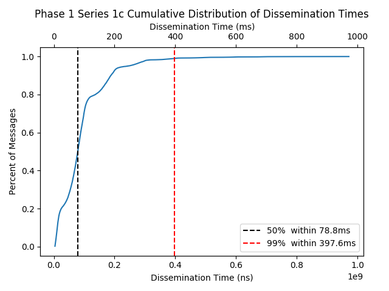
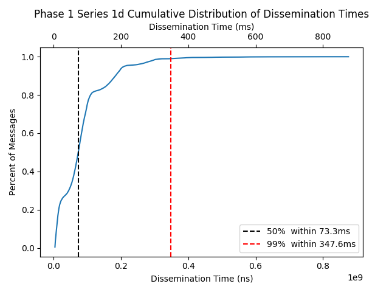
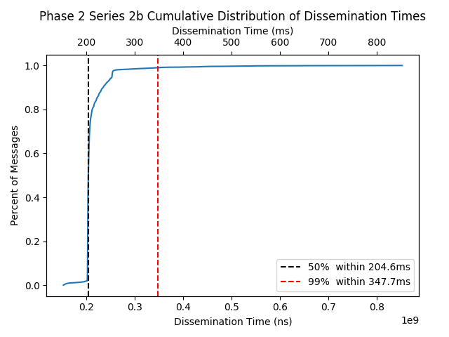
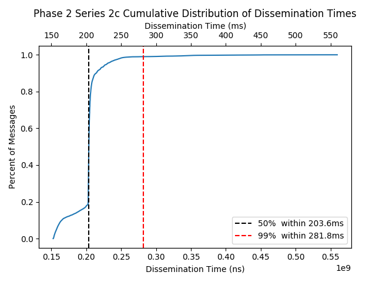
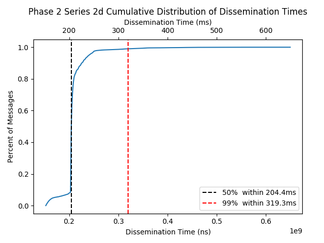
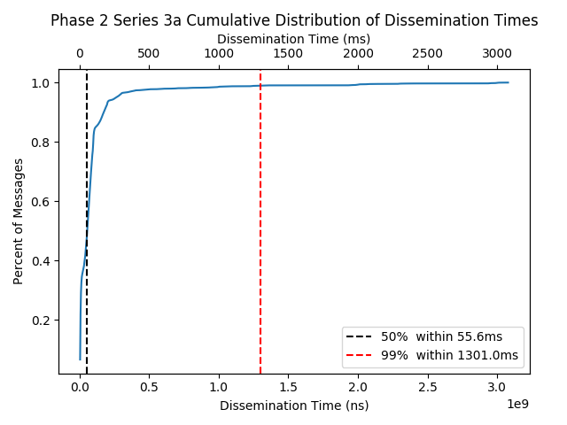
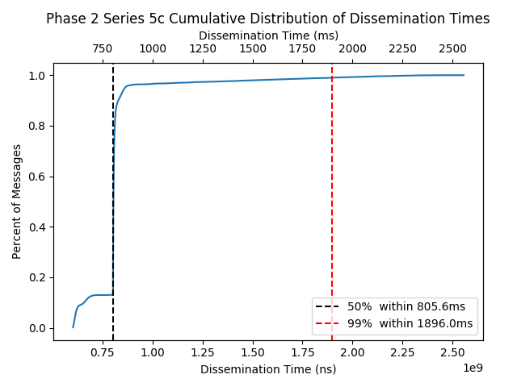
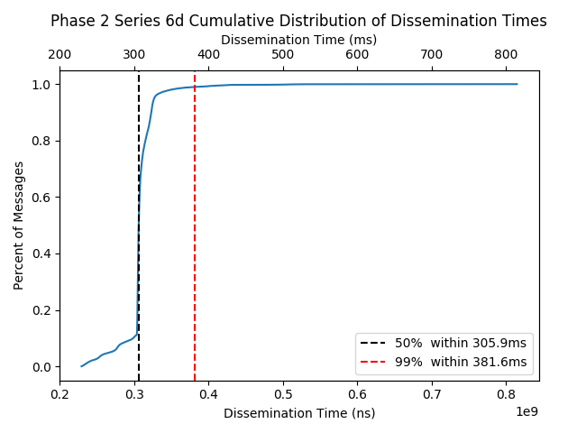

# Eth2 - LibP2P Gossipsub Testing

### Overview
The purpose of this initiative is to test the performance of Libp2p gossipsub protocol implementations. With time constraints present in Eth2, it is important to verify that messages will be able to be disseminated throughout the network in a timely manner. This effort is supported by an [Eth2.0 Grant co-funded by the Ethereum Foundation and ConsenSys](https://blog.ethereum.org/2019/08/26/announcing-ethereum-foundation-and-co-funded-grants/). A synopsis of tests and results can be found in section ["Synopsis of All Tests and Results"](#Synopsis-of-All-Tests-and-Results).

## Community Feedback

We invite all community members interested in providing feedback to visit our discourse on this topic at the following link: https://community.whiteblock.io/t/gossipsub-tests/17/10.

## Table of Contents
- [Introduction - Understanding Testing Scope](#introduction---understanding-testing-scope)
    - [Important Test Parameter Constants](#important-test-parameter-constants)
    - [System Specifications](#System-Specifications)
    - [Resource Allocation Motivation](#Resource-Allocation-Motivation)
- [Understanding Test Phases and Series](#understanding-test-phases-and-series)
    - [Phases](#phases)
    - [Series](#series)
    - [Link: Google Sheet with All Results](#link-google-sheet-with-all-results)
- [Synopsis of Testing Results](#synopsis-of-overall-testing-results)
- [Testing Metrics](#testing-metrics)
- [Network Topology Generation](#network-topology-generation)
- [Phase 1 Testing and Results](#phase-1-testing-and-results)
    - [Phase 1: Setup Summary](#phase-1-setup-summary)
    - [Phase 1: Test Series](#phase-1-test-series)
    - [Phase 1: Message Delivery Ratio (MDR) Results](#phase-1-message-delivery-ratio-mdr-results)
        - [MDR Fix #1 for Phase 2 - Outbound Peer Queue Size](#mdr-fix-1-for-phase-2---outbound-peer-queue-size)
        - [MDR Fix #2 for Phase 2 - Testing Logic Refactor](#mdr-fix-2-for-phase-2---testing-logic-refactor)
    - [Phase 1: Total Time to Dissemination (“Total Nano Time”)](#phase-1-total-time-to-dissemination-total-nano-time)
- [Phase 2 Testing and Results](#phase-2-testing-and-results)
    - [Phase 2: Summary](#phase-2-setup-summary)
    - [Phase 2: Test Series](#phase-2-test-series)
    - [Phase 2: Message Delivery Ratio (MDR)](#phase-2-message-delivery-ratio-mdr)
    - [Phase 2: Last Delivery Hop Distribution](#phase-2-last-delivery-hop-distribution)
    - [Phase 2: Total Time to Dissemination (“Total Nano Time”)](#phase-2-total-time-to-dissemination-total-nano-time)
    - [Potential Testing Inefficiencies](#potential-testing-inefficiencies)
    - [Phase 2: Resource utilization](#phase-2-resource-utilization)

## Introduction - Understanding Testing Scope

This document presents the first round of results of Whiteblock’s testing and analysis of the libp2p-gossipsub protocol under random topologies with different degree distributions generated using the [Barabasi-Albert (B-A) model](https://en.wikipedia.org/wiki/Barab%C3%A1si%E2%80%93Albert_model). Tests were run using the Whiteblock Genesis platform within a single cloud instance (see System Specifications). Here, a gossip node, or simply “node,” shall specifically refer to a container that participates in the gossip network as a libp2p host. The total memory of the instance was 360GB. For all tests in this report, the parameters of libp2p-gossipsub were left at default (e.g. GossipSubD=6).

While we understand the Ethereum 2.0 network is slated to consist of a much larger network size with nodes acting within several logical roles (e.g. validator), the intent of these tests were to analyze and benchmark the performance of the libp2p-gossipsub implementation. As such, it is important to emphasize overall trends in the results as opposed to individual values presented within the results themselves.

### Important Test Parameter Constants

Presented below is a list of the primary test parameters for consideration. Messages are generated globally. That is, for each message, a random node is selected to be the source node. The purpose of the warm-up time is to allow for the loading of containers and programs as well as the instantiation of topological connections. Nodes that complete warm-up remain idle until the test begins. The “Test Time” indicates the interval at which nodes generate gossip messages. When the test time is elapsed, the nodes continue operating until the “Cool-Down Time” is complete. The purpose of the cool-down period is to allow for any internal queues to empty. All nodes published and subscribed to a single topic.

- Gossip Nodes: 95
- Global Msg/Sec: 200
- Warm-up Time: 60s
- Test Time: 180s
- Cool-Down Time: 600s
- Msg Size: 1000 bytes
- Discovery (mDNS): Off
- Routing: Off
- Security: SECIO
- Peering: Barabasi-Albert (seed=42, varying input degree - parameters)  - { 2, 6, 12, 16 }

The remainder of this document is organized as follows. We have written a full analysis of the test results and readers should jump to the graphs and test result statistics section of each test number as a reference.

### System Specifications

| Resource | Allocation | 
| --------  | --------  |
| CPU op-mode(s) | 32-bit, 64-bit |
| CPU(s) | 96 |
| Thread(s) per core |2 |
| Core(s) per socket|24|
| Socket(s) | 2 |
| Model name | Intel(R) Xeon(R) CPU @ 2.00GHz |
| CPU MHz | 2000.168 |
| L1d cache | 32K |
| L1i cache | 32K |
| L2 cache | 1024K |
| L3 cache | 39424K |
| Memory block size | 1G |
| Total online memory | 360G |

Table 1: System Specifications

### Resource Allocation Motivation

In the [prior study](https://github.com/whiteblock/p2p-tests), results showed high CPU utilization when running the `go-libp2p-daemon` in a Docker containers with one CPU allocated per node. In addition, a [preliminary study](https://github.com/protolambda/go-libp2p-gossip-berlin) showed that SHA-256 and general secio cryptography are the largest resource consumers when using `libp2p-gossipsub`. To address these issues, we will use a direct libp2p host implementation and log resource consumption (cpu, memory, and I/O) to ensure CPU usage is not a bottleneck in the performance of `libp2p-gossipsub`.

## Understanding Test Phases and Series

### Phases

This research effort is split into test phases to illustrate to the community the progress and results of this effort over time. The intent of phases is to release results iteratively and to engage the community. After each phase, community feedback is gathered and additional features are integrated into the next phase to enhance results based on this community feedback.

### Series

Within each phase, there will be a series of tests, each with a theme such as bandwidth variation and packet loss variation.

### Link: Google Sheet with All Results

To help readability, all testing results have been compiled and organized into the Google Sheet linked below. 

- [Link to Gossipsub Testing Results Compilation](https://docs.google.com/spreadsheets/d/1ZoY8Rz-BqKiX-ik9Wdd-zfR0mcoOj_CYUSz8tSwtb6w/edit#gid=0)

## Synopsis of All Tests and Results

In this section, we present a general summary of the testing results. Phase 1 tests primarily focused on the correctness of the host implementation and testing methodology. The results of phase 1 uncovered message losses of 30% due to Golang channel queue overflows in the `go-libp2p-pubsub` host implementation and inconsistent delays introduced by Golang tickers used in the testing methodology. The channel overflows were remedied by increasing channel queue sizes and changing the testing methodology which resulted in 0% message loss for network topologies generated using a Barabasi-Albert input parameter greater than 2. Phase 2 focused on introducing network impairments to stress test the gossipsub protocol. Overall, Phase 2 results show that gossipsub performs sufficiently well to suit the Ethereum 2.0 specifications. Under large network latencies of 400ms, the maximum gossip time during tests was 4.573 seconds, which is under the 6 second block time specification. Results showed no CPU resource throttling under the utilized testing setup and methodology. However, results did show erratic message interrarival times which may be caused by a potential inefficiency in `go-libp2p-pubsub` implementation. More details can be found in section "[Potential Testing Inefficiencies](#potential-testing-inefficienccies)".

## Testing Metrics

In [[2]](#References), Leitao et. al present the following metrics to evaluate gossip protcols. The test metrics are collected and analyzed using the tools provided in `agencyenterprise/go-libp2p-pubsub-benchmark-tools`, and the description below is taken directly from the same repository.

The metrics computed are:
1. **TotalNanoTime** - the time (in nano seconds) for the message to propogate the network
2. **LastDeliveryHop** - the hop count of the last message that is delivered by a [pubsub] protocol or, in other words, is the maximum number of hops that a message must be forwarded in the overlay before it is delivered.

## Network Topology Generation

To evaluate the performance and reliability of the gossipsub protocol, we test the host-client implementation against two types of topologies: fully connected and random-connected using the [Barabasi-Albert (B-A)](https://en.wikipedia.org/wiki/Barab%C3%A1si%E2%80%93Albert_model) model. While these topologies may present an oversimplification, it is unclear what the resulting topologies of Eth2 due to large contingency on the final discovery service protocol deployed. Thus, this research effort will attempt to test gossipsub in a fully connected network as well as random topologies generated by known methods in order to evaluate gossipsub's performance.

#### Random Scale-Free Network Topology (Barabasi-Albert or B-A):

In 1999, Barabasi and Albert observed that the world wide web exhibited a scale-free nature and preferential attachment. Scale-free networks follow a power-law degree distribution, and preferential attachment describes the likelihood of a node connecting to nodes with high degrees. Inspired by this Barabasi-Albert (B-A) model was created to generate random network topologies with both a power-law degree distribution and preferential attachment. As described by Albert-Barabasi in [[3]](#References) topology generation is "grown" starting with a small number $m_0$ of nodes. At each time step, a new node with *m &le; m<sub>0</sub>* edges that link the new node to $m$ different nodes currently present in the network. *m* is the *input degree parameter*. When choosing nodes, the probability *&Pi;* that a new node will connect to some node $i$ depends on the degree *k<sub>i</sub>* of node *i* such that:

<a align="center" href="https://www.codecogs.com/eqnedit.php?latex=\fn_jvn&space;\Pi(k_i)&space;=&space;\frac{k_{i}}{\sum_{j}&space;k_{j}}" target="_blank"></a>

Network topologies for testing are generated using the [NetworkX](https://networkx.github.io/) python library with a constant seed to make results reproducible. More specifics about the topology used are in explained in each Phase section. An example of a topology with *m = 4* is pictured below.

<p align="center">
    
</p>

## Phase 1 Testing and Results

### Phase 1: Setup Summary

For all tests, each node will use a fork of the following host and client implementation will be used: https://github.com/agencyenterprise/go-libp2p-pubsub-benchmark-tools. This implementation includes tools for generating messages at each node and analysis tools for parsing and plotting metrics described in the next section. The fork consists only of modified configuration files.

### Phase 1: Test Series

| Topology | Series 1a | Series 1b | Series 1c | Series 1d |
| -------- | ------ | ------ | ------ | ------ |
| Network Latency (ms) | 0 | 0 | 0 | 0 |
| Packet Loss (%) | 0 | 0 | 0 | 0 |
| Bandwidth (MB) | 1000 | 1000 | 1000 | 1000 |
| Total Nodes | 95 | 95 | 95 | 95
| Message Size (B) | 1000 | 1000 | 1000 | 1000 |
| Network-Wide Message Rate (msgs/s) | 200 | 200 | 200 | 200 |
| Topology | B-A | B-A | B-A | B-A |
| Input Deg. Param. | 2 | 6 | 12 | 16 |

<p align="center"> Table 2: Phase 1 Series 1 Test</p>

### Phase 1: Message Delivery Ratio (MDR) Results

The primary observation of concern within Phase 1 tests was the message delivery ratio, or packet delivery ratio, was not 100%. At a message rate of 200 msgs/sec, we expected 36,000 messages to be generated per test. At lower message rates, the delivery ratio was 100%. In Test Series 1a, the number of messages received was 25365/30000 (70.4%) or a drop rate of ~30%. Further analysis verified that the dropped packets were not a result of insufficient cool-down time. This was verified using two methods. The first was processing the logs of each individual node to see if messages were still being gossipped prior to the tests shutting down. The logs indicated that each message ID was received 95 times (i.e., once per node with no messages in-transit). To further account for this, the second method was to run a test with a two hour cool-down time. This second method also yielded the same results, implying the drop rate caused by either the protocol itself or the test client implementation.

##### MDR Fix #1 for Phase 2 - Outbound Peer Queue Size

The first diagnosis of this problem was that the saturated network of gossip messages caused overflows of internal Golang channel queues. The go-libp2p-pubsub community provided a possible fix by adding a feature to change peer outbound channel queue size in the following pull request. The corresponding Godoc is also linked below.

* https://github.com/libp2p/go-libp2p-pubsub/pull/230
* https://godoc.org/github.com/libp2p/go-libp2p-pubsub#WithPeerOutboundQueueSize

After rerunning the tests which implemented this first fix in the test client, the message loss was reduced, however preliminary results still indicated a loss rate of ~22% (as opposed to ~30%). Fix #2 below and other changes introduced before Phase 2 successfully addressed the message loss issue. Further details are presented in section “[Phase 2 Testing and Results](#Phase-2-Testing-And-Results)”.

##### MDR Fix #2 for Phase 2 - Testing Logic Refactor

Traffic generation is orchestrated by a container separate from all gossiping nodes called the “Orchestra”. The Orchestra uses RPCs to instruct gossiping nodes to transmit a new message. In the initial implementation of Orchestra in [agencyenterprise/go-libp2p-pubsub-benchmark-tools](https://github.com/agencyenterprise/go-libp2p-pubsub-benchmark-tools), the testing logic timed messages via a Golang ticker set to tick at the intended intermessage interval (e.g. 5ms).The ticker was enabled only during the duration of the test, not during warmup or cooldown. Further analysis of the test logs demonstrated that not all ticks were successfully executed before the end of the test. To fix this, Orchestra was refactored in a fork of [agencyenterprise/go-libp2p-pubsub-benchmark-tools](https://github.com/agencyenterprise/go-libp2p-pubsub-benchmark-tools) to continue tests until the expected number of messages in a test  sent. The expected number of messages is calculated by taking the test duration and dividing it by the intermessage interval. The refactoring commit to make Orchestra send a defined number of messages is in the link below. This fork of the original repository agencyenterprise/go-libp2p-pubusub-benchmark-tools serves as the code used for Phase 2 and onward.

* https://github.com/whiteblock/go-libp2p-pubsub-benchmark-tools

Phase 2 results demonstrate that MDR Fix #1 and #2 successfully addressed the message loss issue. 

### Phase 1: Total Time to Dissemination (“Total Nano Time”)

In the test scenarios, the distribution graphs of total nano times included an initial spike followed by several “lobes” in a shape similar to a poisson distribution. One interesting result is the lobes in preliminary test runs where the message interval rate was 20msg/sec were absent. The distribution of total nano times followed a poisson distribution. Below is a graph which overlays all tests 1a-1d to illustrate the graphs in Sections III-VI appear to have varying lobe heights due to different Y-axis ranges


<p align="center">
    
</p>

<p align="center"> Graph 1: Series 1 a-d Total Nano Time</p>

<p float="center">
    
    
</p>

<p align="left"> 
    Graph 1a Phase 1 Series 1a
    &nbsp;&nbsp;&nbsp;&nbsp;&nbsp;&nbsp;&nbsp;&nbsp;&nbsp;&nbsp;&nbsp;&nbsp;
    &nbsp;&nbsp;&nbsp;&nbsp;&nbsp;&nbsp;&nbsp;&nbsp;&nbsp;&nbsp;&nbsp;&nbsp;
    &nbsp;&nbsp;&nbsp;&nbsp;&nbsp;&nbsp;&nbsp;&nbsp;&nbsp;&nbsp;&nbsp;&nbsp;
    &nbsp;&nbsp;&nbsp;&nbsp;&nbsp;&nbsp;&nbsp;&nbsp;&nbsp;&nbsp;&nbsp;&nbsp;
    Graph 1b: Phase 1 Series 1b
</p>

<p float="center">
    
    
</p>

<p align="left"> 
    Graph 1c: Phase 1 Series 1c
    &nbsp;&nbsp;&nbsp;&nbsp;&nbsp;&nbsp;&nbsp;&nbsp;&nbsp;&nbsp;&nbsp;&nbsp;
    &nbsp;&nbsp;&nbsp;&nbsp;&nbsp;&nbsp;&nbsp;&nbsp;&nbsp;&nbsp;&nbsp;&nbsp;
    &nbsp;&nbsp;&nbsp;&nbsp;&nbsp;&nbsp;&nbsp;&nbsp;&nbsp;&nbsp;&nbsp;&nbsp;
    &nbsp;&nbsp;&nbsp;&nbsp;&nbsp;&nbsp;&nbsp;&nbsp;&nbsp;&nbsp;&nbsp;&nbsp;
    Graph 1d: Phase 1 Series 1d
</p>

For each increase in B-A degree inputs, the initial spike of short nano times and heights of the first lobe did not follow a particular trend. The peaks of the initial spikes in tests 1a, 1b, 1c, and 1d are approximately 5650, 3950, 3550 and 2850, respectively. The peaks of the first lobe in tests 1a, 1b, 1c, and 1d are approximately 1400, 1500, 1650, and 1650, respectively. It is inconclusive what the effects of degree distributions are on total nano times. The presence of lobes cannot be explained by the GossipSubHeartbeatInterval[6], which is defaulted to 1 second at the time of these tests. The approximate times of the peaks of the spikes followed by the first three lobes are 6 ms, 75 ms, 170 ms, and 266 ms, respectively. These distances are far less than 1 second.

The average nano times (in milliseconds) for tests 1a-1d are 154 ms, 65 ms, 67 ms, 75 ms, respectively. While an input degree parameter of 2 shows larger average nano times (this can also be seen in the higher lobes in the nano time graphs), more statistical evidence is needed to determine if higher degrees of connectivity affect the average nano times using the default gossipsub parameters.

The average time for the messages to be received/propagated in test 1a was the highest and the average time decreased as the “degree of connectivity” increased in subsequent tests. This demonstrates a correlation to the number of messages that have been received. If the full number of messages were properly received, the average time for message propagation would become more skewed.


## Phase 2 Testing and Results

### Phase 2: Setup Summary

* Testing via the Whiteblock Genesis platform
* Libp2p Host implementation (new fork): 
    * https://github.com/whiteblock/go-libp2p-pubsub-benchmark-tools
* Random topologies generated using Barabasi-Albert model
* Includes the implementation of network impairments

### Phase 2: Test Series

Phase 2 consists of multiple series of tests to focus on discovering any issues with the testing framework and libp2p implementation by stress-testing the software with different variables.

| Latency Test | Series 2a | Series 2b | Series 2c | Series 2d |
| -------- | ------ | ------ | ------ | ------ |
| Network Latency (ms) | 100 | 100 | 100 | 100 |
| Packet Loss (%) | 0 | 0 | 0 | 0 |
| Bandwidth (MB) | 1000 | 1000 | 1000 | 1000 |
| Total Nodes | 95 | 95 | 95 | 95
| Message Size (B) | 1000 | 1000 | 1000 | 1000 |
| Network-Wide Message Rate (msgs/s) | 200 | 200 | 200 | 200 |
| Topology | B-A | B-A | B-A | B-A |
| Input Deg. Param. | 2 | 6 | 12 | 16 |
<p align="center"> Table 3: Series 2 - Latency Test</p>

| Packet Loss Test | Series 3a | Series 3b | Series 3c | Series 3d |
| -------- | ------ | ------ | ------ | ------ |
| Network Latency (ms) | 0 | 0 | 0 | 0 |
| Packet Loss (%) | 0.1 | 0.1 | 0.1 | 0.1 |
| Bandwidth (MB) | 1000 | 1000 | 1000 | 1000 |
| Total Nodes | 95 | 95 | 95 | 95
| Message Size (B) | 1000 | 1000 | 1000 | 1000 |
| Network-Wide Message Rate (msgs/s) | 200 | 200 | 200 | 200 |
| Topology | B-A | B-A | B-A | B-A |
| Input Deg. Param. | 2 | 6 | 12 | 16 |

<p align="center"> Table 4:  Series 3 - Packet Loss Test</p>

| Bandwidth Test | Series 4a | Series 4b | Series 4c |
| -------- | ------ | ------ | ------ |
| Network Latency (ms) | 0 | 0 | 0 |
| Packet Loss (%) | 0 | 0 | 0 |
| Bandwidth (MB) | 10 | 50 | 100 |
| Total Nodes | 95 | 95 | 95 |
| Message Size (B) | 1000 | 1000 | 1000 |
| Network-Wide Message Rate (msgs/s) | 200 | 200 | 200 |
| Topology | B-A | B-A | B-A | 
| Input Deg. Param. | 6 | 6 | 6 |

<p align="center"> Table 5:  Series 4 - Bandwidth Test</p>

| Increased Latency Test | Series 5a | Series 5b | Series 5c | Series 5d |
| -------- | ------ | ------ | ------ | ------ |
| Network Latency (ms) | 400 | 400 | 400 | 400 |
| Packet Loss (%) | 0 | 0 | 0 | 0 |
| Bandwidth (MB) | 1000 | 1000 | 1000 | 1000 |
| Total Nodes | 95 | 95 | 95 | 95
| Message Size (B) | 1000 | 1000 | 1000 | 1000 |
| Network-Wide Message Rate (msgs/s) | 200 | 200 | 200 | 200 |
| Topology | B-A | B-A | B-A | B-A |
| Input Deg. Param. | 2 | 6 | 12 | 16 |

<p align="center"> Table 6:  Series 5 - Increased Latency Test</p>

| Stress Test | Series 6a | Series 6b | Series 6c | Series 6d |
| -------- | ------ | ------ | ------ | ------ |
| Network Latency (ms) | 150 | 150 | 150 | 150 |
| Packet Loss (%) | 0.01 | 0.01 | 0.01 | 0.01 |
| Bandwidth (MB) | 10 | 10 | 10 | 10 |
| Total Nodes | 95 | 95 | 95 | 95
| Message Size (B) | 1000 | 1000 | 1000 | 1000 |
| Network-Wide Message Rate (msgs/s) | 200 | 200 | 200 | 200 |
| Topology | B-A | B-A | B-A | B-A |
| Input Deg. Param. | 2 | 6 | 12 | 16 |

<p align="center"> Table 7:  Series 6 - Stress Test</p>


### Phase 2: Message Delivery Ratio (MDR)

The message delivery ratio observed in the Phase 2 tests was 99.3% - 100%. At a message rate of 200 msgs/sec, we had sent 36,000 messages to be generated per test. Upon implementing the fixes from [MDR Fix #1](#MDR-Fix-1-for-Phase-2---Outbound-Peer-Queue-Size) and [MDR Fix #2](#MDR-Fix-2-for-Phase-2---Testing-Logic-Refactor), the message delivery rate was rectified and any message loss was not the result of implementation errors. The results did, however, exhibit a menial degree of message loss (Series1a: 22, Series2a: 39, Series3a: 246, Series5a: 10, Series6a: 40) that was observed, and they were all found for cases with a degree input of 2. The reason for this slight message loss is due to an overflow of the queue mentioned in MDR Fix #1, peerOutboundQueueSize, which is set to the default of 32 in our tests. 

Generally speaking, the degree distribution of a network affected the Last Delivery Hop (the number of hops a gossip message has to make in order to reach the last receiving node). There is a correlation between the degree of connectivity and last delivery hop. As shown in Graph 2, it is observed that as the degree was increased, the delivery hop count decreased. 

### Phase 2: Last Delivery Hop Distribution

Generally speaking, the degree distribution of a network affected the Last Delivery Hop (the number of hops a gossip message has to make in order to reach the last receiving node). There is a correlation between the degree of connectivity and last delivery hop. As shown in Graph 2, it is observed that the as the degree was increased, the delivery hop count decreased. 

<p align="center">
    
</p>

<p align="center"> Graph 2: Last Delivery Hop Count </p>

The drop then quickly plateaus after it’s initial drop. This trend suggests that the degree of connectivity of greater than 2 will not affect the last delivery hop assuming GossipSubD = 6 and the number of nodes ~100. Typically, hops scale with O(log(N)) where N is the size of the network. Further investigation is needed to understand the relationship of network size to last delivery hop count when using the gossipsub protocol. Also, at a low degree distribution (B-A degree input of 2), the variance of last delivery hop increased. This is expected as sparser topologies should result in an increased number of hops for each gossip message.

### Phase 2: Total Time to Dissemination (“Total Nano Time”)

<p align="center">
    
</p>

<p align="center"> Graph 3: Total Time for Series 1-6 Results Overlayed </p>

<p align="center">
    
</p>

<p float="center">
    
    
</p>

<p align="left"> 
    Graph 4: Phase 2 Series 1a 
    &nbsp;&nbsp;&nbsp;&nbsp;&nbsp;&nbsp;&nbsp;&nbsp;&nbsp;&nbsp;&nbsp;&nbsp;
    &nbsp;&nbsp;&nbsp;&nbsp;&nbsp;&nbsp;&nbsp;&nbsp;&nbsp;&nbsp;&nbsp;&nbsp;
    &nbsp;&nbsp;&nbsp;&nbsp;&nbsp;&nbsp;&nbsp;&nbsp;&nbsp;&nbsp;&nbsp;&nbsp;
    &nbsp;&nbsp;&nbsp;&nbsp;&nbsp;&nbsp;&nbsp;&nbsp;&nbsp;&nbsp;&nbsp;&nbsp;
    Graph 5: Phase 2 Series 1b 
</p>

<p float="center">
    
    
</p>

<p align="left"> 
    Graph 6: Phase 2 Series 1c
    &nbsp;&nbsp;&nbsp;&nbsp;&nbsp;&nbsp;&nbsp;&nbsp;&nbsp;&nbsp;&nbsp;&nbsp;
    &nbsp;&nbsp;&nbsp;&nbsp;&nbsp;&nbsp;&nbsp;&nbsp;&nbsp;&nbsp;&nbsp;&nbsp;
    &nbsp;&nbsp;&nbsp;&nbsp;&nbsp;&nbsp;&nbsp;&nbsp;&nbsp;&nbsp;&nbsp;&nbsp;
    &nbsp;&nbsp;&nbsp;&nbsp;&nbsp;&nbsp;&nbsp;&nbsp;&nbsp;&nbsp;&nbsp;&nbsp;
    Graph 7: Phase 2 Series 1d
</p>

<p align="center"> Graph 8: Series 1 a-d Total Nano Time  </p>

<p align="center">
    
</p>

<p align="center"> Graph 9: Series 2 a-d Total Nano Time </p>

<p float="center">
    
    
</p>

<p align="left"> 
    Graph 10: Phase 2 Series 2a
    &nbsp;&nbsp;&nbsp;&nbsp;&nbsp;&nbsp;&nbsp;&nbsp;&nbsp;&nbsp;&nbsp;&nbsp;
    &nbsp;&nbsp;&nbsp;&nbsp;&nbsp;&nbsp;&nbsp;&nbsp;&nbsp;&nbsp;&nbsp;&nbsp;
    &nbsp;&nbsp;&nbsp;&nbsp;&nbsp;&nbsp;&nbsp;&nbsp;&nbsp;&nbsp;&nbsp;&nbsp;
    &nbsp;&nbsp;&nbsp;&nbsp;&nbsp;&nbsp;&nbsp;&nbsp;&nbsp;&nbsp;&nbsp;&nbsp;
    Graph 11: Phase 2 Series 2b
</p>

<p float="center">
    
    
</p>

<p align="left"> 
    Graph 12: Phase 2 Series 2c
    &nbsp;&nbsp;&nbsp;&nbsp;&nbsp;&nbsp;&nbsp;&nbsp;&nbsp;&nbsp;&nbsp;&nbsp;
    &nbsp;&nbsp;&nbsp;&nbsp;&nbsp;&nbsp;&nbsp;&nbsp;&nbsp;&nbsp;&nbsp;&nbsp;
    &nbsp;&nbsp;&nbsp;&nbsp;&nbsp;&nbsp;&nbsp;&nbsp;&nbsp;&nbsp;&nbsp;&nbsp;
    &nbsp;&nbsp;&nbsp;&nbsp;&nbsp;&nbsp;&nbsp;&nbsp;&nbsp;&nbsp;&nbsp;&nbsp;
    Graph 13: Phase 2 Series 2d
</p>

<p align="center">
    
</p>

<p align="center"> Graph 14: Series 3 a-d Total Nano Time </p>

<p float="center">
    
    
</p>

<p align="left"> 
    Graph 15: Phase 2 Series 3a
    &nbsp;&nbsp;&nbsp;&nbsp;&nbsp;&nbsp;&nbsp;&nbsp;&nbsp;&nbsp;&nbsp;&nbsp;
    &nbsp;&nbsp;&nbsp;&nbsp;&nbsp;&nbsp;&nbsp;&nbsp;&nbsp;&nbsp;&nbsp;&nbsp;
    &nbsp;&nbsp;&nbsp;&nbsp;&nbsp;&nbsp;&nbsp;&nbsp;&nbsp;&nbsp;&nbsp;&nbsp;
    &nbsp;&nbsp;&nbsp;&nbsp;&nbsp;&nbsp;&nbsp;&nbsp;&nbsp;&nbsp;&nbsp;&nbsp;
    Graph 16: Phase 2 Series 3b
</p>

<p float="center">
    
    
</p>

<p align="left"> 
    Graph 17: Phase 2 Series 3c
    &nbsp;&nbsp;&nbsp;&nbsp;&nbsp;&nbsp;&nbsp;&nbsp;&nbsp;&nbsp;&nbsp;&nbsp;
    &nbsp;&nbsp;&nbsp;&nbsp;&nbsp;&nbsp;&nbsp;&nbsp;&nbsp;&nbsp;&nbsp;&nbsp;
    &nbsp;&nbsp;&nbsp;&nbsp;&nbsp;&nbsp;&nbsp;&nbsp;&nbsp;&nbsp;&nbsp;&nbsp;
    &nbsp;&nbsp;&nbsp;&nbsp;&nbsp;&nbsp;&nbsp;&nbsp;&nbsp;&nbsp;&nbsp;&nbsp;
    Graph 18: Phase 2 Series 3d
</p>

<p align="center">
    
</p>

<p align="center"> Graph 19: Series 4 a-d Total Nano Time </p>


<p float="center">
    
    
</p>

<p align="left"> 
    Graph 20: Phase 2 Series 4a
    &nbsp;&nbsp;&nbsp;&nbsp;&nbsp;&nbsp;&nbsp;&nbsp;&nbsp;&nbsp;&nbsp;&nbsp;
    &nbsp;&nbsp;&nbsp;&nbsp;&nbsp;&nbsp;&nbsp;&nbsp;&nbsp;&nbsp;&nbsp;&nbsp;
    &nbsp;&nbsp;&nbsp;&nbsp;&nbsp;&nbsp;&nbsp;&nbsp;&nbsp;&nbsp;&nbsp;&nbsp;
    &nbsp;&nbsp;&nbsp;&nbsp;&nbsp;&nbsp;&nbsp;&nbsp;&nbsp;&nbsp;&nbsp;&nbsp;
    Graph 21: Phase 2 Series 4b
</p>

<p float="center">
    
</p>

<p align="left"> 
    Graph 22: Phase 2 Series 4c
</p>

<p align="center">
    
</p>

<p align="center"> Graph 23: Series 5 a-d Total Nano Time  </p>

<p float="center">
    
    
</p>

<p align="left"> 
    Graph 24: Phase 2 Series 5a
    &nbsp;&nbsp;&nbsp;&nbsp;&nbsp;&nbsp;&nbsp;&nbsp;&nbsp;&nbsp;&nbsp;&nbsp;
    &nbsp;&nbsp;&nbsp;&nbsp;&nbsp;&nbsp;&nbsp;&nbsp;&nbsp;&nbsp;&nbsp;&nbsp;
    &nbsp;&nbsp;&nbsp;&nbsp;&nbsp;&nbsp;&nbsp;&nbsp;&nbsp;&nbsp;&nbsp;&nbsp;
    &nbsp;&nbsp;&nbsp;&nbsp;&nbsp;&nbsp;&nbsp;&nbsp;&nbsp;&nbsp;&nbsp;&nbsp;
    Graph 25: Phase 2 Series 5b
</p>

<p float="center">
    
    
</p>

<p align="left"> 
    Graph 26: Phase 2 Series 5c
    &nbsp;&nbsp;&nbsp;&nbsp;&nbsp;&nbsp;&nbsp;&nbsp;&nbsp;&nbsp;&nbsp;&nbsp;
    &nbsp;&nbsp;&nbsp;&nbsp;&nbsp;&nbsp;&nbsp;&nbsp;&nbsp;&nbsp;&nbsp;&nbsp;
    &nbsp;&nbsp;&nbsp;&nbsp;&nbsp;&nbsp;&nbsp;&nbsp;&nbsp;&nbsp;&nbsp;&nbsp;
    &nbsp;&nbsp;&nbsp;&nbsp;&nbsp;&nbsp;&nbsp;&nbsp;&nbsp;&nbsp;&nbsp;&nbsp;
    Graph 27: Phase 2 Series 5d
</p>

<p align="center">
    
</p>

<p align="center"> Graph 28: Series 6 a-d Total Nano Time </p>

<p float="center">
    
    
</p>

<p align="left"> 
    Graph 29: Phase 2 Series 6a
    &nbsp;&nbsp;&nbsp;&nbsp;&nbsp;&nbsp;&nbsp;&nbsp;&nbsp;&nbsp;&nbsp;&nbsp;
    &nbsp;&nbsp;&nbsp;&nbsp;&nbsp;&nbsp;&nbsp;&nbsp;&nbsp;&nbsp;&nbsp;&nbsp;
    &nbsp;&nbsp;&nbsp;&nbsp;&nbsp;&nbsp;&nbsp;&nbsp;&nbsp;&nbsp;&nbsp;&nbsp;
    &nbsp;&nbsp;&nbsp;&nbsp;&nbsp;&nbsp;&nbsp;&nbsp;&nbsp;&nbsp;&nbsp;&nbsp;
    Graph 30: Phase 2 Series 6b
</p>

<p float="center">
    
    
</p>

<p align="left"> 
    Graph 31: Phase 2 Series 6c
    &nbsp;&nbsp;&nbsp;&nbsp;&nbsp;&nbsp;&nbsp;&nbsp;&nbsp;&nbsp;&nbsp;&nbsp;
    &nbsp;&nbsp;&nbsp;&nbsp;&nbsp;&nbsp;&nbsp;&nbsp;&nbsp;&nbsp;&nbsp;&nbsp;
    &nbsp;&nbsp;&nbsp;&nbsp;&nbsp;&nbsp;&nbsp;&nbsp;&nbsp;&nbsp;&nbsp;&nbsp;
    &nbsp;&nbsp;&nbsp;&nbsp;&nbsp;&nbsp;&nbsp;&nbsp;&nbsp;&nbsp;&nbsp;&nbsp;
    Graph 32: Phase 2 Series 6d
</p>

The graphs for series 2 - 6 are very similar to the one shown in Phase 1. Graphs 4, 6 and 7 are identical, with a high initial spike then followed by “lobes”. Like [Graph 3 in Phase 1](#Phase-1-Total-Time-to-Dissemination-“Total-Nano-Time”), The lobes here also have a shape similar to a poisson distribution. The time each message had taken to reach its destination had been recorded and then aggregated. The graphs above (Graph 4 - 9) show that the highest peaks occurred for test cases with the lowest input degree parameter of connectivity. 

The average times recorded for messages ranged from 50 - 300 ms for all tests without latency impairments. Test series 5 introduced packet latencies of 400ms on the network and the average times recorded for Case A, Case B and Case C was about 1296, 834, and 620 ms, respectively. The drastic increase in delivery time was expected as a high network delay will cause the messages to reach its destination at a later time. 

The results from tests 2a, 5a, and 6a (input degree param m = 2 with various network impairments) showed different behaviors from tests run with higher input degree parameters. For cases with m >= 2,  the highest amplitude was the initial peak in all graphs. However, for 2a, 5a, and 6a the highest peak was the second peak, and there were several additional peaks. In addition, the graphs have spikes instead of lobes. Test series 2, 5, and 6 had injected network delays and bandwidth variations. 

### Phase 2 Resource Utilization

The aggregated resource usage was logged during the full duration of the warm-up, test, and cool-down. The maximum cpu usage in a single test run ranged between  19% - 72% usage. The average cpu usage per test run ranged from ~0.04% - 1%. The variance is due to the distribution of peers (network degree) that was generated by the random Barabasi-Albert Connected Graph Algorithm. Nonetheless, the CPU utilization never approached 100% which verifies that CPU load was not a bottleneck during tests.

The aggregated resource usage was logged during the full duration of the warm-up, test, and cool-down. The maximum cpu usage in the test series are presented below. For series 1-4, the average cpu usage ranged from ~1.5%-22%. For series 5 & 6, the average cpu usage ranged from 0.04% - 1%. The max cpu usage ranged from 19% - 72% for series 1-4. The max cpu usage ranged from 0.18% - 2.86% for series 5 & 6 (with the exception of series 5c & 5d, which ranges from 0.25%-48.93% and 0.28%-48.07% respectively). 

The behavior observed in series 5 & 6 are interesting as those test series had the harshest network impairments applied. Series 5 was introduced to a delay of 400ms, and series 6 had a delay of 150ms, bandwidth of 10mb, and packet loss of 0.01%. The results suggest that network impairments may reduce the overall CPU load of a test. Possible reasons for this could be the network delays reduce the load on the go-libp2p stack. Traffic shaping is performed via `tc`, which is known to also consume CPU resources. `tc` essentially creates virtual queues and gates packet transmissions which means data is indeed queued. However, these queues are operating at a lower layer in the network stack. It is possible go-libp2p resource consumption increases when messages arrive and are queued at the application layer. Nonetheless, the CPU utilization never approached 100% which verifies that the cloud instance had sufficient resources to not present a processing bottleneck.

* Link to Resource Usage Sheet: https://docs.google.com/spreadsheets/d/1ZoY8Rz-BqKiX-ik9Wdd-zfR0mcoOj_CYUSz8tSwtb6w/edit#gid=228791707

### Potential Testing Inefficiencies

During our testing initiatives, there were a few observations that we suggest be investigated further by the go-libp2p-pubsub community.

After [MDR Fix #2](#MDR-Fix-1-for-Phase-2---Outbound-Peer-Queue-Size), the Orchestra’s message interarrival times experienced erratic and high variations. Overall, this behavior may have a slight impact on the message time since measurements are only made from initial transmission to complete dissemination. Graphs 10 and 11 below illustrate the inter-arrival times and compares the actual message initial transmission time with its expected transmission time during a test. These graphs show that nodes are blocking at some point in the code. It is suggested that further investigation on this behavior is done to diagnose this implementation weakness.

<p align="center">
    
</p>

<p align="center"> Graph 10: Example Message Interarrival Times </p>

<p align="center">
    
</p>

<p align="center"> Graph 11: Example Message Transmission Timeline </p>


The initial test results found in the preliminary tests had an incredibly high amount of message loss (~30%). The bug had been found and fixed ([see PR](https://github.com/araskachoi/go-libp2p-pubsub-benchmark-tools/pull/1)) and the result of subsequent tests yielded all (or nearly all) messages reaching their destinations. 

The results of test Series 3 Case A include message losses. Logs show that the network load generating node (Orchestra) successfully sent a RPC request for a node to transmit a message. This can be seen in the Orchestra log screenshot in Figure 1. This indicates that messages were lost at nodes, perhaps due to go channel overflows. While the logs showed that the messages were still in transit, we removed them from analysis and treated them as message losses. The total number of messages lost was 236. 

<p align="center">
    
</p>
<p align="center"> Figure 1: Series3a Messages</p>

### Configuration
For each set of tests, the corresponding configuration used in running the [`agencyenterprise/go-libp2p-pubsub-benchmark-tools`](https://github.com/agencyenterprise/go-libp2p-pubsub-benchmark-tools) and the [`whiteblock/go-libp2p-pubsub-benchmark-tools`](https://github.com/whiteblock/go-libp2p-pubsub-benchmark-tools) implementations will be posted.

Example host.json:
```
{
  "host": {
    "privPEM": "",
    "transports": ["tcp", "ws"],
    "listens": ["/ip4/0.0.0.0/tcp/3000","/ip4/0.0.0.0/tcp/3001/ws"],
    "rpcAddress": "0.0.0.0:8080",
    "peers": [],
    "muxers": [["yamux", "/yamux/1.0.0"], ["mplex", "/mplex/6.7.0"]],
    "security": "secio",
    "pubsubAlgorithm": "gossip",
    "omitRelay": false,
    "omitConnectionManager": false,
    "omitNATPortMap": false,
    "omitRPCServer": false,
    "omitDiscoveryService": true,
    "omitRouting": true,
    "loggerLocation": ""
  }
}

```

Example orchestra.json:
```
{
  "orchestra": {
    "omitSubnet": true,
    "hostRPCAddressesIfOmitSubnet": [<list-of-IPs>],
    "messageNanoSecondInterval": 100000000,
    "clientTimeoutSeconds": 5,
    "messageLocation": "client.message.json",
    "messageByteSize": 1000,
    "testDurationSeconds": 90,
    "testWarmupSeconds": 10,
    "testCooldownSeconds": 10
  },
  "subnet": {
    "numHosts": 10,
    "pubsubCIDR": "127.0.0.1/8",
    "pubsubPortRange": [3000, 4000],
    "rpcCIDR": "127.0.0.1/8",
    "rpcPortRange": [8080, 9080],
    "peerTopology": "whiteblocks"
  },
  "host": {
    "transports": ["tcp", "ws"],
    "muxers": [["yamux", "/yamux/1.0.0"], ["mplex", "/mplex/6.7.0"]],
    "security": "secio",
    "pubsubAlgorithm": "gossip",
    "omitRelay": false,
    "omitConnectionManager": false,
    "omitNATPortMap": false,
    "omitRPCServer": false,
    "omitDiscoveryService": false,
    "omitRouting": false
  },
  "general": {
    "loggerLocation": ""
  }
}

```

/etc/docker/daemon.json
```
{
        "max-concurrent-uploads":1,
        "storage-driver": "overlay",
        "log-driver":"gcplogs"
}
```

## References

[1] R. Bakhshi, F. Bonnet, W. Fokkink, and B. Haverkort, “Formal analysis techniques for gossiping protocols,”SIGOPS Oper. Syst.Rev., vol. 41, no. 5, pp. 28–36, Oct. 2007.

[2] J. Leitão, J. Pereira, and L. Rodrigues, “Epidemic broadcast trees,” Proc. IEEE Symp. Reliab. Distrib. Syst., pp. 301–310, 2007.

[3] R.  Albert  and  A.-L.  Barabasi,  “Statistical  mechanics  of  complex  networks,”Reviews of Modern Physics, vol. 74, no. 1, p. 47–97, Jan 2002.

[4] A. Montresor, “Gossip and epidemic protocol,” Wiley Encyclopedia of Electrical and Electronics Engineering, vol. 1, 2017.

[5] eth2 phase 0 networking requirements, "https://notes.ethereum.org/zgzMxFNiSF-iW5wA5uKH0Q?view"

[6] https://github.com/libp2p/go-libp2p-pubsub/blob/01b9825fbee1848751d90a8469e3f5f43bac8466/gossipsub.go#L32
