# Eth2 - LibP2P Gossipsub Testing

### Overview
The purpose of this initiative is to test the performance of the gossipsub protocol implementation in [go-libp2p-pubsub](https://github.com/libp2p/go-libp2p-pubsub). With time constraints present in Ethereum 2.0, it is important to verify that messages will be disseminated throughout the network in a timely manner.  This effort is supported by an [Eth2.0 Grant co-funded by the Ethereum Foundation and ConsenSys](https://blog.ethereum.org/2019/08/26/announcing-ethereum-foundation-and-co-funded-grants/).

## Synopsis of Tests and Results

Currently, this testing effort has completed two phases. Tests were run using the Whiteblock Genesis platform on a single, large cloud instance. The test network size was 95 nodes for both phases, and nodes were run in separate Docker containers in the cloud instance. In each test, messages are generated globally at 200 msgs/s where each message is transmitted by a randomly selected node.

Phase 1 tests focused on the correctness of the the host implementation (go-libp2p-core & go-libp2p-pubsub) and testing methodology. The results of phase 1 uncovered message losses of 30% due to Golang channel queue overflows in the `go-libp2p-pubsub` host implementation and inconsistent delays introduced by Golang tickers used by the phase 1 testing methodology. `go-libp2p-pubsub` developers provided a remedy for overflows by adding a feature which allows increasing internal channel queue sizes. The methodology of generating gossipsub messages with Golang tickers was also changed. The fixes resulted in 0% message loss for network topologies generated using a Barabasi-Albert input parameter greater than 2. While these fixes worked for the scope of testing, it is highly suggested a permanent solution beyond increasing queue sizes is implemented.

Phase 2 focused on introducing network impairments to stress test the gossipsub protocol. Overall, Phase 2 results show that gossipsub performs sufficiently well to suit the Ethereum 2.0 specifications. Under large network latencies of 400ms between any two nodes, the maximum gossip time during tests was 4.573 seconds which is under the 6 second block time specification. Results showed CPU resources were never throttled (i.e. CPU usage never reached 100%). However, results did show erratic message interrarival times which may be caused by a potential inefficiency in the `go-libp2p-pubsub` implementation or testing methodology. More details can be found in section "[Potential Testing Inefficiencies](#potential-testing-inefficienccies)."

The first two phases of this testing effort has brought to light various issues in which the community has responded with fixes. Scalability testing is the next logical step, and we have provided a summary of future work for the community to enhance Libp2p, Gossipsub, and Whiteblock Genesis to achieve testing of larger network sizes. These next steps are outlined in Section "[Next Steps - Community Solicited Research](#Next-Steps---Community-Solicited-Research)."

## Community Feedback

We invite all community members interested in providing feedback to visit our discourse on this topic at the following link: https://community.whiteblock.io/t/gossipsub-tests/17/10.

## Table of Contents
- [Introduction](#introduction)
    - [Important Test Parameter Constants](#important-test-parameter-constants)
    - [System Specifications](#System-Specifications)
    - [Resource Allocation Motivation](#Resource-Allocation-Motivation)
- [Understanding Test Phases and Series](#understanding-test-phases-and-series)
    - [Phases](#phases)
    - [Series](#series)
    - [Link: Google Sheet with All Results](#link-google-sheet-with-all-results)
- [Testing Metrics](#testing-metrics)
- [Network Topology Generation](#network-topology-generation)
- [Phase 1 Testing and Results](#phase-1-testing-and-results)
    - [Phase 1: Setup Summary](#phase-1-setup-summary)
    - [Phase 1: Test Series](#phase-1-test-series)
    - [Phase 1: Message Delivery Ratio (MDR) Results](#phase-1-message-delivery-ratio-mdr-results)
        - [MDR Fix #1 for Phase 2 - Outbound Peer Queue Size](#mdr-fix-1-for-phase-2---outbound-peer-queue-size)
        - [MDR Fix #2 for Phase 2 - Testing Logic Refactor](#mdr-fix-2-for-phase-2---testing-logic-refactor)
    - [Phase 1: Message Dissemination Time (“Total Nano Time”) Results](#Phase-1-Message-Dissemination-Time-“Total-Nano-Time”-results)
- [Phase 2 Testing and Results](#phase-2-testing-and-results)
    - [Phase 2: Summary](#phase-2-setup-summary)
    - [Phase 2: Test Series](#phase-2-test-series)
    - [Phase 2: Message Delivery Ratio (MDR) Results](#phase-2-message-delivery-ratio-mdr-results)
    - [Phase 2: Last Delivery Hop Distribution Results](#phase-2-last-delivery-hop-distribution-Results)
    - [Phase 2: Message Dissemination Time (“Total Nano Time”) Results](#Phase-2-Message-Dissemination-Time-“Total-Nano-Time”-results)
    - [Phase 2: Resource utilization Results](#phase-2-resource-utilization-results)
    - [Potential go-libp2p-pubsub Inefficiencies](#Potential-go-libp2p-pubsub-Inefficiencies)

- [Next Steps - Community Solicited Research](#Next-Steps---Community-Solicited-Research)

## Introduction

This document presents the results of Whiteblock’s testing and analysis of the Libp2p Gossipsub protocol. The protocol was tested in networks with random topologies of varying degree distributions generated using the [Barabasi-Albert (B-A) model](https://en.wikipedia.org/wiki/Barab%C3%A1si%E2%80%93Albert_model) (see [Network Topology Generation](#network-topology-generation)). Tests were run using the Whiteblock Genesis platform (see System Specifications). In this document, a gossip node, or simply “node,” shall specifically refer to a Docker container that participates in the gossip network by running an instance of a libp2p "[Host](https://github.com/libp2p/go-libp2p-core/blob/master/host/host.go)." Tests were performed on a large cloud instance with 96 CPUs and 360GB of memory (see [System Specifications](#system-specifications)). For all tests in this report, the parameters of `go-libp2p-pubsub/gossipsub` were left at spec defaults (e.g. GossipSubD=6).

While we understand the Ethereum 2.0 network is slated to consist of a much larger network size with nodes performing several logical roles (e.g. validators), the intent of these tests is to provide an initial benchmark of the libp2p-gossipsub implementation which will guide future work in testing  larger network sizes. As such, it is important analyze overall trends in the results and focus on suggesting improvements for libp2p to help with future testing and benchmarking efforts.

### Important Test Parameter Constants

Presented below is a list of primary test parameters for consideration. Gossip messsages in a network is generated globally by a separate container called the "Orchestra" node. That is, for each message, the Orchestra node selects random node in the network and instructs said node to generate a gossip message to be disseminated to all peers. At the start of the test, a warm-up time is inserted to allow for the loading of containers and programs as well as the instantiation of topological connections. The current go-libp2p code does not currently allow the ability to track the completion of program instantiation, and it is suggested this feature be added to make testing larger networks easier. This will remove the need to estimate a suitable warm-up time for tests. Once the warm-up time ends, the Orchestra node will begin to generate messages. The “Test Time” indicates the interval at which nodes generate gossip messages. When the test time completes, the nodes continue operating until the “Cool-Down Time” is complete. The purpose of the cool-down period is to allow for any internal queues to empty. All nodes publish and subscribeto a single go-libp2p-pubsub topic.

- Gossip Nodes: 95
- Global Msg/Sec: 200
- Warm-up Time: 60s
- Test Time: 180s
- Cool-Down Time: 600s
- Msg Size: 1000 bytes
- [Discovery](https://github.com/agencyenterprise/go-libp2p-pubsub-benchmark-tools/blob/588f32beeda7db9ec160c3f4f06c094e8adf6542/pkg/host/host.go#L292) (mDNS): Off
- [Routing](https://github.com/agencyenterprise/go-libp2p-pubsub-benchmark-tools/blob/588f32beeda7db9ec160c3f4f06c094e8adf6542/pkg/host/host.go#L132) (kad-DHT): Off
- Security: SECIO
- Peering: Barabasi-Albert (seed=42, varying input degree - parameters)  - { 2, 6, 12, 16 }

The message size of 1000 bytes was used as a rough estimate of the average message size to expect in Eth2. This value is not indicative of any finalized values that will be used in the Eth2 network.

Discovery and Routing has been turned off as these parameters utilize the built in mDNS and kad-DHT, respectively. The intent is to control how the nodes select peers to properly generate a desired network topology. Thus, these features were turned off to manually peer nodes.

SECIO message encryption is enabled as this is default security for Libp2p. This encryption has also been used for [interop](https://whiteblock.io/ethereum-2-0-grant-update-2-interop/) efforts.

Readers interested in the results should jump directly to the [Phase 1](#phase-1-testing-and-results) and [Phase 2](#phase-1-testing-and-results) testing and results sections.

### Resource Allocation Motivation

In the [prior study](https://github.com/whiteblock/p2p-tests), results showed high CPU utilization when running the `go-libp2p-daemon` in a Docker container with one CPU allocated per node. In addition, a [preliminary study](https://github.com/protolambda/go-libp2p-gossip-berlin) showed that SHA-256 and general secio cryptography are the largest resource consumers. To address these issues, tests were done using a direct libp2p host implementation and resource consumption (cpu, memory, and I/O) was logged to ensure CPU usage is not a performance bottleneck.


### System Specifications

| Resource | Allocation | 
| --------  | --------  |
| CPU op-mode(s) | 32-bit, 64-bit |
| CPU(s) | 96 |
| Thread(s) per core |2 |
| Core(s) per socket|24|
| Socket(s) | 2 |
| Model name | Intel(R) Xeon(R) CPU @ 2.00GHz |
| CPU MHz | 2000.168 |
| L1d cache | 32K |
| L1i cache | 32K |
| L2 cache | 1024K |
| L3 cache | 39424K |
| Memory block size | 1G |
| Total online memory | 360G |

Table 1: System Specifications

## Understanding Test Phases and Series

### Phases

This research effort is split into test phases to illustrate to the community the progress and results over time. After each phase, community feedback is gathered and additional features are integrated into the next phase to enhance future results.

### Series

Within each phase, there are a series of tests, each with a theme such as bandwidth variation or packet loss variation.

### Link: Google Sheet with All Results

To help with readability, all testing results have been compiled and organized into the Google Sheet linked below. 

- [Gossipsub Testing Results Compilation](https://docs.google.com/spreadsheets/d/1ZoY8Rz-BqKiX-ik9Wdd-zfR0mcoOj_CYUSz8tSwtb6w/edit#gid=0)

## Testing Metrics

In [[2]](#References), Leitao et. al present the following metrics to evaluate gossip protcols. The test metrics are collected and analyzed using the tools provided in `agencyenterprise/go-libp2p-pubsub-benchmark-tools`, and the description below is taken directly from the same repository.

The metrics computed are:
1. **TotalNanoTime (Message Dissemination Time)** - the time (in nano seconds) for the message to disseminate to all nodes in the network.
2. **LastDeliveryHop (LDH)** - the hop count of the last message that is delivered by a [pubsub] protocol or, in other words, is the maximum number of hops that a message must be forwarded in the overlay before it is delivered.

## Network Topology Generation

To evaluate gossipsub’s performance and reliability, we tested the protocol against two types of topologies: fully connected and random-connected using the [Barabasi-Albert (B-A)](https://en.wikipedia.org/wiki/Barab%C3%A1si%E2%80%93Albert_model) model. While these topologies may present an oversimplification, Ethereum 2.0’s  resulting topology is largely contingent on the final discovery service protocol deployed. Until the discovery service is finalized, it is of interest to test against known topology models.

#### Random Scale-Free Network Topology (Barabasi-Albert or "B-A"):

In 1999, Barabasi and Albert observed that the world wide web exhibited a scale-free nature and preferential attachment. Scale-free networks follow a power-law degree distribution, and preferential attachment describes the likelihood of a node connecting to nodes with high degrees (i.e., number of peer connections). Inspired by this Barabasi-Albert (B-A) model was created to generate random network topologies with both a power-law degree distribution and preferential attachment. As described by Albert-Barabasi in [[3]](#References) topology generation is "grown" starting with a small number *m<sub>0</sub>* of nodes. At each time step, a new node with *m &le; m<sub>0</sub>* edges that link the new node to *m* different nodes currently present in the network is created. ***m*** is the **B-A input degree parameter**. When choosing nodes, the probability *&Pi;* that a new node will connect to some node *i* depends on the degree *k<sub>i</sub>* of node *i* such that:

<a align="center" href="https://www.codecogs.com/eqnedit.php?latex=\fn_jvn&space;\Pi(k_i)&space;=&space;\frac{k_{i}}{\sum_{j}&space;k_{j}}" target="_blank"></a>

Network topologies for testing are generated using the [NetworkX](https://networkx.github.io/) python library with a constant seed to make results reproducible. More specifics about the topology used are in explained in each Phase section. An example of a topology with *m = 4* is pictured below.

<p align="center">
    
</p>

## Phase 1 Testing and Results

### Phase 1: Setup Summary

For Phase 1 tests, each node uses a fork of the following host and client implementation: https://github.com/agencyenterprise/go-libp2p-pubsub-benchmark-tools. This implementation includes tools for generating messages at each node and analysis tools for parsing and plotting metrics described in the next section. The fork consists only of modified configuration files.

### Phase 1: Test Series

| Topology Test | Series 1a | Series 1b | Series 1c | Series 1d |
| -------- | ------ | ------ | ------ | ------ |
| Network Latency (ms) | 0 | 0 | 0 | 0 |
| Packet Loss (%) | 0 | 0 | 0 | 0 |
| Bandwidth (MB) | 1000 | 1000 | 1000 | 1000 |
| Total Nodes | 95 | 95 | 95 | 95
| Message Size (B) | 1000 | 1000 | 1000 | 1000 |
| Network-Wide Message Rate (msgs/s) | 200 | 200 | 200 | 200 |
| Topology | B-A | B-A | B-A | B-A |
| Input Deg. Param. | 2 | 6 | 12 | 16 |

<p align="center"> Table 2: Phase 1 Series 1 - Topology Test</p>

### Phase 1: Message Delivery Ratio (MDR) Results

The primary observation of concern within Phase 1 tests was the message delivery ratio, or packet delivery ratio, which was not 100%. At a global message rate of 200 msgs/sec, we expected 36,000 messages to be generated per test. When quickly testing lower message rates, the delivery ratio reached 100% which suggests that the implementation used cannot handle high network traffic (note: results of this quick test are not posted for brevity). In Test Series 1a, the number of messages received was 25365/30000 (70.4%) or a drop rate of ~30%. Further analysis verified that the dropped messages were *not* a result of insufficient cool-down time (i.e., nodes were unable to fully empty their queues). 

The first method to verify this was processing the logs of each individual node to see if messages were still being gossipped prior to the tests shutting down. The logs indicated that each message ID present in the logs was received 95 times indicating there were no messages still in transit by the time the tests shut down. To further account for this, we ran tests with a large two hour cool-down time. This second method also yielded the same results, implying the drop rate is caused by the protocol itself, implementation used, and/or testing methodology.

##### MDR Fix #1 for Phase 2 - Outbound Peer Queue Size

The first diagnosis of this problem was that the saturated network of gossip messages caused overflows of internal Golang channel queues. The go-libp2p-pubsub community provided a possible fix by adding a feature to change peer outbound channel queue size in the following pull request. The corresponding Godoc is also linked below.

* https://github.com/libp2p/go-libp2p-pubsub/pull/230
* https://godoc.org/github.com/libp2p/go-libp2p-pubsub#WithPeerOutboundQueueSize

After rerunning the tests which implemented this first fix in the test client, the message loss was reduced (note: these results are not posted for brevity as they are unnecessary results). However, the tests still indicated a loss rate of ~22% (lower than the original ~30%). Fix #2 below in junction with Fix #1 removed all message losses and were integrated prior to Phase 2 tests. Further details are presented in section “[Phase 2 Testing and Results](#Phase-2-Testing-And-Results)”. While the additional feature of increasing queue size remedied the message losses, it is highly suggested that a more elegant, permanent fix be introduce to remove the dependence on queue sizes. Having to modify queue sizes depending on the test can present a difficult challenge for large network tests in the future. For future tests, it is suggested to log channel overflows to determine if any internal channel queues of go-libp2p-pubsub are causing further delays/constraints.

##### MDR Fix #2 for Phase 2 - Testing Logic Refactor

Traffic generation is orchestrated by a container separate from all gossiping nodes called the “Orchestra”. The Orchestra uses RPCs to instruct gossiping nodes to transmit a new message. In the initial implementation of Orchestra in [agencyenterprise/go-libp2p-pubsub-benchmark-tools](https://github.com/agencyenterprise/go-libp2p-pubsub-benchmark-tools), the testing logic timed messages via a Golang ticker set to tick at the intended intermessage interval (e.g. 5ms).The ticker was enabled only during the duration of the test, not during warmup or cooldown. Further analysis of the test logs demonstrated that not all ticks were successfully executed before the end of the test. To fix this, Orchestra was refactored in a fork of [agencyenterprise/go-libp2p-pubsub-benchmark-tools](https://github.com/agencyenterprise/go-libp2p-pubsub-benchmark-tools) to continue tests until the expected number of messages in a test sent. The expected number of messages is calculated by taking the test duration and dividing it by the intermessage interval. The refactoring commit to make Orchestra send a defined number of messages is in the link below. This fork of the original repository agencyenterprise/go-libp2p-pubusub-benchmark-tools serves as the code used for Phase 2 and onward.

* https://github.com/whiteblock/go-libp2p-pubsub-benchmark-tools

Phase 2 results demonstrate that MDR Fix #1 and #2 successfully addressed the message loss issue. 

### Phase 1: Message Dissemination Time (“Total Nano Time”) Results

In the series 1 tests, the distribution graphs of total nano times included an initial spike followed by several “lobes” in a shape similar to a poisson distribution. This can be seen in Graph 1. One interesting result is the absence of lobes in tests where message rates were low (e.g. 20msg/s, note the result graph is not provided for brevity). The distribution of message dissemination times followed a poisson-distribution-like shape. Below is a graph which overlays the test results of Series 1a-1d for quick comparison. The **individual test graphs can be found in the [Google sheet](https://docs.google.com/spreadsheets/d/1ZoY8Rz-BqKiX-ik9Wdd-zfR0mcoOj_CYUSz8tSwtb6w/edit#gid=0)** of test results.

<p align="center">
    
</p>

<p align="center"> Graph 1: Series 1 a-d Message Dissemination Times (Total Nano Times)</p>

For each increase in B-A degree inputs, the initial spike of short nano times and heights of the first lobe did not follow a particular trend. The height of the initial spikes in tests 1a, 1b, 1c, and 1d are approximately 5650, 3950, 3550 and 2850 messages, respectively. As the degree distribution of a network increases, less messages fall into this initial spike. The height of the first lobe in tests 1a, 1b, 1c, and 1d are approximately 1400, 1500, 1650, and 1650 messages, respectively. At a quick glance it seems like higher degree distributions increase the mean message dissemination time. However, this is not the case. It is inconclusive what the effects of degree distributions are on message dissemination time. The **presence of lobes cannot be explained by the GossipSubHeartbeatInterval[6]**, which was left set at the default of 1 second. The approximate locations of the spikes followed by the first three lobes are rougly 6 ms, 75 ms, 170 ms, and 266 ms, respectively, for all 4 tests. The distances between the peaks are far less than 1 second. 

The distances between the peaks could potentially be introduced by the underlying mesh network gossipsub creates when establishing messaging peers. That is, while nodes may be connected to more than 10 peers, running gossipsub with parameter GossipSubD = 6 will cause a node to propagate messages to only 6 peers. Another potential explanation for the lobes is the relationship between the dissemination time and last delivery hop. For example, [test Series 1a](https://docs.google.com/spreadsheets/d/1ZoY8Rz-BqKiX-ik9Wdd-zfR0mcoOj_CYUSz8tSwtb6w/edit#gid=1224078138) has three local maximums (one spike followed by two lobes) in the total nano time graph. The messages around the first local maximum could be all messages with a last delivery hop of 4, the messages around the second local maximum could be messages with a last delivery hop of 5, etc.

The average message dissemination time (in milliseconds) for tests 1a-1d are 154 ms, 65 ms, 67 ms, 75 ms, respectively. While an input degree parameter of 2 shows larger average nano times (this can also be seen in the higher lobes in the nano time graphs), the last three average message dissemination times show more statistical evidence is needed to determine if higher degrees of connectivity affect the average message dissemination times using the default gossipsub parameters. 

<p float="center">
    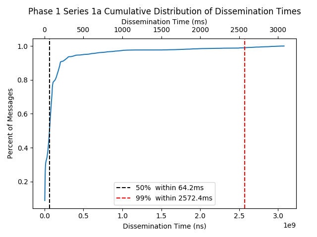
    
</p>

<p align="left"> 
    Graph 1a Phase 1 Series 1a
    &nbsp;&nbsp;&nbsp;&nbsp;&nbsp;&nbsp;&nbsp;&nbsp;&nbsp;&nbsp;&nbsp;&nbsp;
    &nbsp;&nbsp;&nbsp;&nbsp;&nbsp;&nbsp;&nbsp;&nbsp;&nbsp;&nbsp;&nbsp;&nbsp;
    &nbsp;&nbsp;&nbsp;&nbsp;&nbsp;&nbsp;&nbsp;&nbsp;&nbsp;&nbsp;&nbsp;&nbsp;
    &nbsp;&nbsp;&nbsp;&nbsp;&nbsp;&nbsp;&nbsp;&nbsp;&nbsp;&nbsp;&nbsp;&nbsp;
    Graph 1b: Phase 1 Series 1b
</p>

<p float="center">
    
    
</p>

<p align="left"> 
    Graph 1c: Phase 1 Series 1c
    &nbsp;&nbsp;&nbsp;&nbsp;&nbsp;&nbsp;&nbsp;&nbsp;&nbsp;&nbsp;&nbsp;&nbsp;
    &nbsp;&nbsp;&nbsp;&nbsp;&nbsp;&nbsp;&nbsp;&nbsp;&nbsp;&nbsp;&nbsp;&nbsp;
    &nbsp;&nbsp;&nbsp;&nbsp;&nbsp;&nbsp;&nbsp;&nbsp;&nbsp;&nbsp;&nbsp;&nbsp;
    &nbsp;&nbsp;&nbsp;&nbsp;&nbsp;&nbsp;&nbsp;&nbsp;&nbsp;&nbsp;&nbsp;&nbsp;
    Graph 1d: Phase 1 Series 1d
</p>

Graphs 1a-1d show the cumulative distribution of message disseminatino times. Each graph includes vertical lines which are marked at 50% and 99% of the distribution. These values help us understand the expected delays of message dissemination for half of the messages (the median) and almost all of the messages. The later measurement gives us a better picture of how heavy tailed the distribution of message disseminations times are in a test.

## Phase 2 Testing and Results

### Phase 2: Setup Summary

* Testing via the Whiteblock Genesis platform
* Used a fork (with many changes) of the Phase 1 Libp2p Host implementation:
    * https://github.com/whiteblock/go-libp2p-pubsub-benchmark-tools
* Random topologies generated using Barabasi-Albert model
* Includes the implementation of network impairments

### Phase 2: Test Series

Phase 2 consisted of 6 test series which introduced gossipsub to various network impairments. These tests present some stress to the protocol to uncover any issues of the go-libp2p implementation. The tables below describe the test series, each with 3-4 tests indicated by a different letter.

| Topology Test | Series 1a | Series 1b | Series 1c | Series 1d |
| -------- | ------ | ------ | ------ | ------ |
| Network Latency (ms) | 0 | 0 | 0 | 0 |
| Packet Loss (%) | 0 | 0 | 0 | 0 |
| Bandwidth (MB) | 1000 | 1000 | 1000 | 1000 |
| Total Nodes | 95 | 95 | 95 | 95
| Message Size (B) | 1000 | 1000 | 1000 | 1000 |
| Network-Wide Message Rate (msgs/s) | 200 | 200 | 200 | 200 |
| Topology | B-A | B-A | B-A | B-A |
| Input Deg. Param. | 2 | 6 | 12 | 16 |

<p align="center"> Table 2: Phase 2 Series 1 - Topology Test (i.e., the Baseline)</p>

| Latency Test | Series 2a | Series 2b | Series 2c | Series 2d |
| -------- | ------ | ------ | ------ | ------ |
| Network Latency (ms) | **100** | **100** | **100** | **100** |
| Packet Loss (%) | 0 | 0 | 0 | 0 |
| Bandwidth (MB) | 1000 | 1000 | 1000 | 1000 |
| Total Nodes | 95 | 95 | 95 | 95
| Message Size (B) | 1000 | 1000 | 1000 | 1000 |
| Network-Wide Message Rate (msgs/s) | 200 | 200 | 200 | 200 |
| Topology | B-A | B-A | B-A | B-A |
| Input Deg. Param. | 2 | 6 | 12 | 16 |
<p align="center"> Table 3: Series 2 - 100ms Latency Test</p>

| Packet Loss Test | Series 3a | Series 3b | Series 3c | Series 3d |
| -------- | ------ | ------ | ------ | ------ |
| Network Latency (ms) | 0 | 0 | 0 | 0 |
| Packet Loss (%) | **0.1** | **0.1** | **0.1** | **0.1** |
| Bandwidth (MB) | 1000 | 1000 | 1000 | 1000 |
| Total Nodes | 95 | 95 | 95 | 95
| Message Size (B) | 1000 | 1000 | 1000 | 1000 |
| Network-Wide Message Rate (msgs/s) | 200 | 200 | 200 | 200 |
| Topology | B-A | B-A | B-A | B-A |
| Input Deg. Param. | 2 | 6 | 12 | 16 |

<p align="center"> Table 4:  Series 3 - 0.1% Packet Loss Test</p>

| Bandwidth Test | Series 4a | Series 4b | Series 4c |
| -------- | ------ | ------ | ------ |
| Network Latency (ms) | 0 | 0 | 0 |
| Packet Loss (%) | 0 | 0 | 0 |
| Bandwidth (MB) | **10** | **50** | **100** |
| Total Nodes | 95 | 95 | 95 |
| Message Size (B) | 1000 | 1000 | 1000 |
| Network-Wide Message Rate (msgs/s) | 200 | 200 | 200 |
| Topology | B-A | B-A | B-A | 
| Input Deg. Param. | 6 | 6 | 6 |

<p align="center"> Table 5:  Series 4 - Bandwidth Test</p>

| Increased Latency Test | Series 5a | Series 5b | Series 5c | Series 5d |
| -------- | ------ | ------ | ------ | ------ |
| Network Latency (ms) | **400** | **400** | **400** | **400** |
| Packet Loss (%) | 0 | 0 | 0 | 0 |
| Bandwidth (MB) | 1000 | 1000 | 1000 | 1000 |
| Total Nodes | 95 | 95 | 95 | 95
| Message Size (B) | 1000 | 1000 | 1000 | 1000 |
| Network-Wide Message Rate (msgs/s) | 200 | 200 | 200 | 200 |
| Topology | B-A | B-A | B-A | B-A |
| Input Deg. Param. | 2 | 6 | 12 | 16 |

<p align="center"> Table 6:  Series 5 - 400ms Increased Latency Test</p>

| Stress Test | Series 6a | Series 6b | Series 6c | Series 6d |
| -------- | ------ | ------ | ------ | ------ |
| Network Latency (ms) | **150** | **150** | **150** | **150** |
| Packet Loss (%) | **0.01** | **0.01** | **0.01** | **0.01** |
| Bandwidth (MB) | **10** | **10** | **10** | **10**|
| Total Nodes | 95 | 95 | 95 | 95
| Message Size (B) | 1000 | 1000 | 1000 | 1000 |
| Network-Wide Message Rate (msgs/s) | 200 | 200 | 200 | 200 |
| Topology | B-A | B-A | B-A | B-A |
| Input Deg. Param. | 2 | 6 | 12 | 16 |

<p align="center"> Table 7:  Series 6 - Stress Test</p>


### Phase 2: Message Delivery Ratio (MDR) Results

The message delivery ratio observed in the Phase 2 tests was 99.3% - 100%. At an overall message rate of 200 msgs/sec in the network, the tests generated 36,000 messages to be gossiped. Upon implementing the fixes from [MDR Fix #1](#MDR-Fix-1-for-Phase-2---Outbound-Peer-Queue-Size) and [MDR Fix #2](#MDR-Fix-2-for-Phase-2---Testing-Logic-Refactor), the message loss  was rectified. The results did, however, exhibited a minor degree of message loss (Series1a: 22 messages lost, Series2a: 39 messages lost, Series3a: 246 messages lost, Series5a: 10 messages lost, Series6a: 40 messages lost), and the message losses occured under sparse networks generated with a degree input of *m = 2*. The reason for this slight message loss is due to an overflow of the queue mentioned in MDR Fix #1, peerOutboundQueueSize, which was set to the default of 32 in our tests. A network generated with a B-A input of 2 is far from an ideal network topology because of its sparser nature. Thus, *it is suggested that the peering technology used in Ethereum 2.0 ensures that validators do not have a power law degree distribution resulting in peer sets as small as 2* to avoid low performance that can be seen in all Phase 2 tests with B-A input *m = 2* (i.e. tests 1a, 2a, 3a, 4a, 5a, and 6a).

### Phase 2: Last Delivery Hop Distribution Results

Generally speaking, the degree distribution of a network affected the Last Delivery Hop (LDH). Again, the LDH is the number of hops a gossip message has made when it reached the absolute last receiving node (i.e., to complete message dissemination). There is a correlation between the degree of connectivity and last delivery hop. As shown in Graph 2, it is observed that the as the degree was increased, the average delivery hop count decreased. 

<p align="center">
    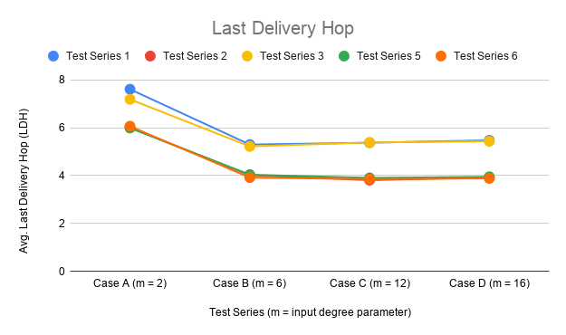
</p>

<p align="center"> Graph 2: Last Delivery Hop Count </p>

The drop quickly stabilizes after its initial drop. This trend suggests that the degree of connectivity of greater than 2 will not affect the last delivery hop assuming GossipSubD = 6 and the number of nodes is 95. Typically, hops scale with O(log(N)) where N is the size of the network. Further investigation is needed to understand the relationship of network size to last delivery hop count when using the gossipsub protocol. Also, at a low degree distribution (B-A degree input of 2), the variance of last delivery hop is larger. This is expected as sparser topologies should result in an increased number of hops for each gossip message. Overall, it is suggested that the Eth2 discovery protocol prevents sparsely connected nodes to optimize block announcement times.

### Phase 2: Message Dissemination Time (“Total Nano Time”) Results

The total message dissemination times logged that has been aggregated in graphs 3-9 show the amount of time each message takes to reach its final destination. The network paths gossip messages take is entirely dictated by the gossipsub protocol as well as the generated network topology. The message time varies from test to test, as shown in the results, and the sparser networks (lower degree of connectivity) are found to have longer times to reach its destination than the tests that had denser network topologies. 

<p align="center">
    
</p>

<p align="center"> Graph 3: Histogram overlay for Phase 2 Series 1-6 results for illustration. Each test series is separated in the graphs below. </p>

##### Phase 2 Series 1 - Topology Test

This test serves as the baseline for Phase 2 (similar to Phase 1 Series 1). The distributions of message dissemination times in this test series have a similar structure to the Phase 1 Series 1 tests, however, the overall dissemination times in this test is **lower** than Phase 1 Series 1 which had no latency. In Phase1 Series 1d, 99% of messages were disseminated within 347.6 ms while in Phase 2 Series 1d, 99% of messages were disseminated within 305.5 ms. The reason behind the lower times can be explained by the changes introduced to the libp2p host implementation for Phase 2. Compared to Phase 1, more messages were logged allowing for higher statistical significance and the larger queue sizes may have reduced the overall intermessage times (see section [Potential go-libp2p-pubsub Inefficiencies](#Potential-go-libp2p-pubsub-Inefficiencies)).

<p align="center">
    
</p>

<p align="center"> Graph 4: Series 1 a-d Total Nano Time  </p>

<p float="center">
    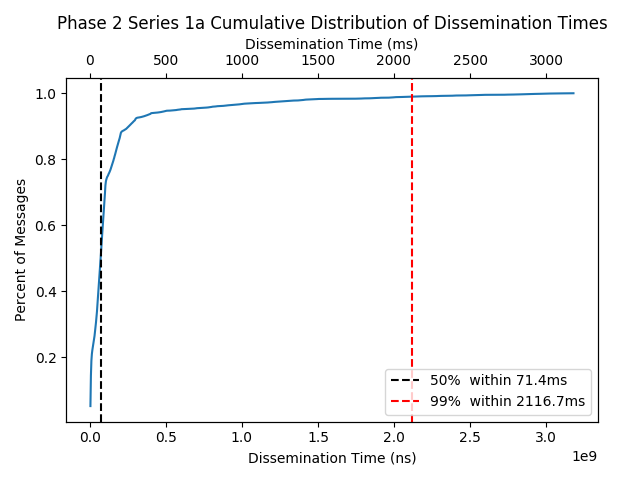
    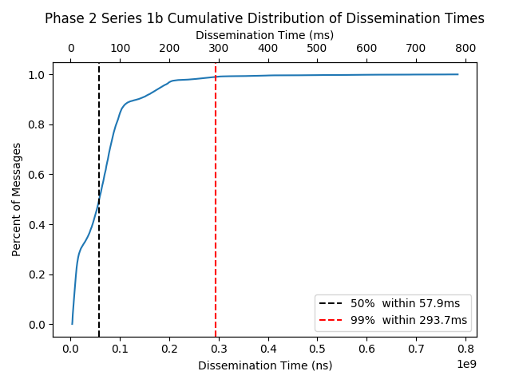
</p>

<p align="left"> 
    Graph 5: Phase 2 Series 1a 
    &nbsp;&nbsp;&nbsp;&nbsp;&nbsp;&nbsp;&nbsp;&nbsp;&nbsp;&nbsp;&nbsp;&nbsp;
    &nbsp;&nbsp;&nbsp;&nbsp;&nbsp;&nbsp;&nbsp;&nbsp;&nbsp;&nbsp;&nbsp;&nbsp;
    &nbsp;&nbsp;&nbsp;&nbsp;&nbsp;&nbsp;&nbsp;&nbsp;&nbsp;&nbsp;&nbsp;&nbsp;
    &nbsp;&nbsp;&nbsp;&nbsp;&nbsp;&nbsp;&nbsp;&nbsp;&nbsp;&nbsp;&nbsp;&nbsp;
    Graph 6: Phase 2 Series 1b 
</p>

<p float="center">
    
    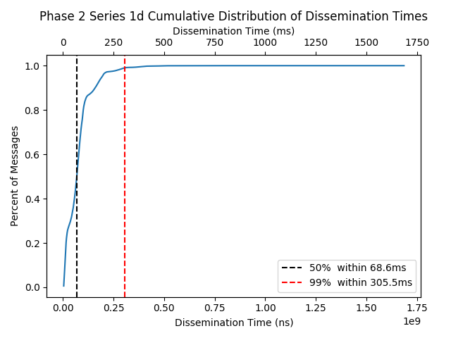
</p>

<p align="left"> 
    Graph 7: Phase 2 Series 1c
    &nbsp;&nbsp;&nbsp;&nbsp;&nbsp;&nbsp;&nbsp;&nbsp;&nbsp;&nbsp;&nbsp;&nbsp;
    &nbsp;&nbsp;&nbsp;&nbsp;&nbsp;&nbsp;&nbsp;&nbsp;&nbsp;&nbsp;&nbsp;&nbsp;
    &nbsp;&nbsp;&nbsp;&nbsp;&nbsp;&nbsp;&nbsp;&nbsp;&nbsp;&nbsp;&nbsp;&nbsp;
    &nbsp;&nbsp;&nbsp;&nbsp;&nbsp;&nbsp;&nbsp;&nbsp;&nbsp;&nbsp;&nbsp;&nbsp;
    Graph 8: Phase 2 Series 1d
</p>

##### Phase 2 Series 2 - 100ms Latency Test

This series fixed the latency at 100ms. The distribution of dissemination times for Series2a resulted in three local maximums which take the shape of an initial spike followed by an exponential decay. Each spike is separated at about 50ms, which is half of the 100ms network delays introduced. While this behavior is odd, we believe the Ethereum 2.0 peering protocol should not result in a sparse network to avoid this message dissemination time behavior. 

For tests 2b, 2c, and 2d, the distribution resulted in a shap of a spike followed by an exponential decay. The initial spike sits at 200 ms, which is twice the network latency introduced. The last delivery hop was 4 for almost all messages transmitted on the network for the last three tests. This could explain the dissemination time of ~200ms for most messages. However, with a network latency of 100ms and last delivery hop of 4, the expected dissemination times should be 400ms. 

Overall, it seems like the network latencies introduced packet delays which helped dampen the distribution of message dissemination times. The lobes seen in Series 1 are no longer present, and this is expected since most messages took 4 hops to reach the last node. In Phase 1, we mentioned that the lobes may be correlated with the last delivery hop, and the results in this test further support this hypothesis.

<p align="center">
    
</p>

<p align="center"> Graph 9: Phase 2 Series 2 a-d Total Nano Time </p>

<p float="center">
    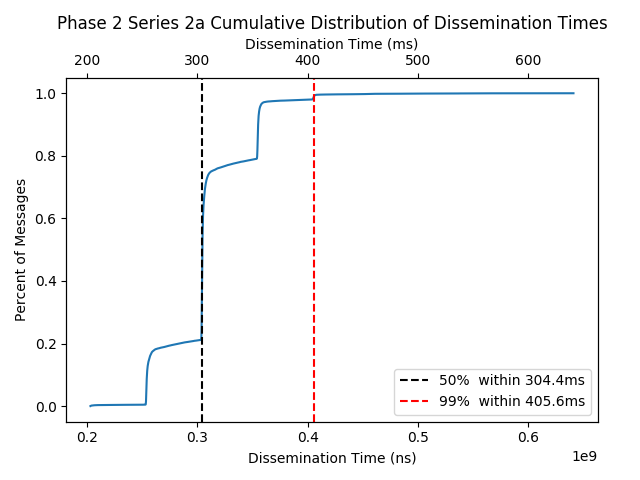
    
</p>

<p align="left"> 
    Graph 10: Phase 2 Series 2a
    &nbsp;&nbsp;&nbsp;&nbsp;&nbsp;&nbsp;&nbsp;&nbsp;&nbsp;&nbsp;&nbsp;&nbsp;
    &nbsp;&nbsp;&nbsp;&nbsp;&nbsp;&nbsp;&nbsp;&nbsp;&nbsp;&nbsp;&nbsp;&nbsp;
    &nbsp;&nbsp;&nbsp;&nbsp;&nbsp;&nbsp;&nbsp;&nbsp;&nbsp;&nbsp;&nbsp;&nbsp;
    &nbsp;&nbsp;&nbsp;&nbsp;&nbsp;&nbsp;&nbsp;&nbsp;&nbsp;&nbsp;&nbsp;&nbsp;
    Graph 11: Phase 2 Series 2b
</p>

<p float="center">
    
    
</p>

<p align="left"> 
    Graph 12: Phase 2 Series 2c
    &nbsp;&nbsp;&nbsp;&nbsp;&nbsp;&nbsp;&nbsp;&nbsp;&nbsp;&nbsp;&nbsp;&nbsp;
    &nbsp;&nbsp;&nbsp;&nbsp;&nbsp;&nbsp;&nbsp;&nbsp;&nbsp;&nbsp;&nbsp;&nbsp;
    &nbsp;&nbsp;&nbsp;&nbsp;&nbsp;&nbsp;&nbsp;&nbsp;&nbsp;&nbsp;&nbsp;&nbsp;
    &nbsp;&nbsp;&nbsp;&nbsp;&nbsp;&nbsp;&nbsp;&nbsp;&nbsp;&nbsp;&nbsp;&nbsp;
    Graph 13: Phase 2 Series 2d
</p>

##### Phase 2 Series 3 - 0.1% Packet Loss Test

This test series fixed the packet loss at 0.1% which can be seen as an acceptable packet loss rate for a distributed system. Overall, the impact of 0.1% loss is minimal. The results of these tests are similar to Phase 2 Sereis 1.

<p align="center">
    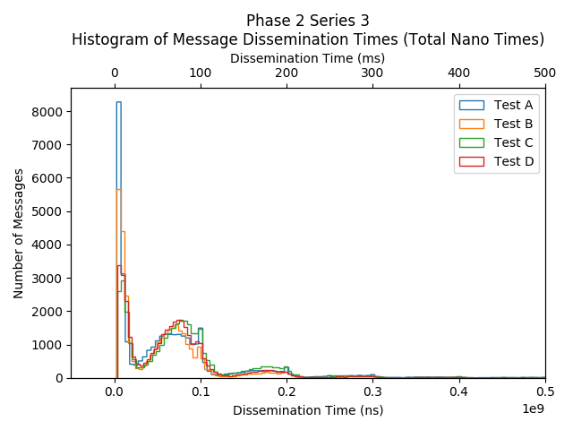
</p>

<p align="center"> Graph 14: Phase 2 Series 3 a-d Total Nano Time </p>

<p float="center">
    
    
</p>

<p align="left"> 
    Graph 15: Phase 2 Series 3a
    &nbsp;&nbsp;&nbsp;&nbsp;&nbsp;&nbsp;&nbsp;&nbsp;&nbsp;&nbsp;&nbsp;&nbsp;
    &nbsp;&nbsp;&nbsp;&nbsp;&nbsp;&nbsp;&nbsp;&nbsp;&nbsp;&nbsp;&nbsp;&nbsp;
    &nbsp;&nbsp;&nbsp;&nbsp;&nbsp;&nbsp;&nbsp;&nbsp;&nbsp;&nbsp;&nbsp;&nbsp;
    &nbsp;&nbsp;&nbsp;&nbsp;&nbsp;&nbsp;&nbsp;&nbsp;&nbsp;&nbsp;&nbsp;&nbsp;
    Graph 16: Phase 2 Series 3b
</p>

<p float="center">
    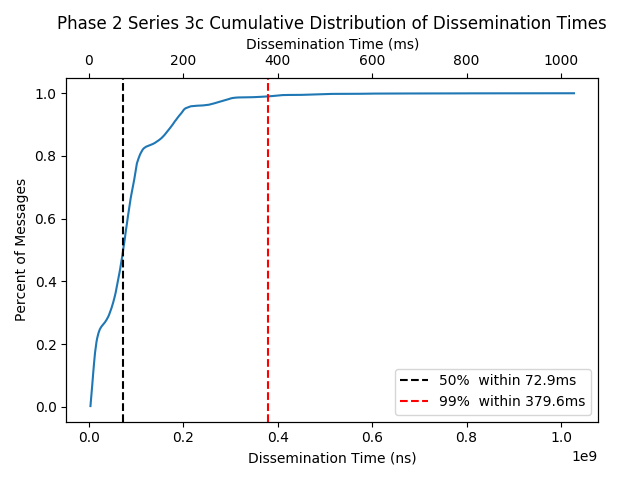
    
</p>

<p align="left"> 
    Graph 17: Phase 2 Series 3c
    &nbsp;&nbsp;&nbsp;&nbsp;&nbsp;&nbsp;&nbsp;&nbsp;&nbsp;&nbsp;&nbsp;&nbsp;
    &nbsp;&nbsp;&nbsp;&nbsp;&nbsp;&nbsp;&nbsp;&nbsp;&nbsp;&nbsp;&nbsp;&nbsp;
    &nbsp;&nbsp;&nbsp;&nbsp;&nbsp;&nbsp;&nbsp;&nbsp;&nbsp;&nbsp;&nbsp;&nbsp;
    &nbsp;&nbsp;&nbsp;&nbsp;&nbsp;&nbsp;&nbsp;&nbsp;&nbsp;&nbsp;&nbsp;&nbsp;
    Graph 18: Phase 2 Series 3d
</p>

##### Phase 2 Series 4 - Bandwidth Test (10 MB/s, 50 MB/s, 100 MB/s)

This test series varied the bandwidth across a single topology, generated with B-A input parameter *m = 6*. A parameter of 6 ensures all nodes have at least 6 peers to allow gossipsub to operate as intended with the GossipSubD parameter defaulting at 6. While the overall network traffic of all tests was high, the bandwidth variation had minimal effect on the gossipsub protocol performance. The distribution of dissemination times were similar to the baseline test Series 1.

<p align="center">
    
</p>

<p align="center"> Graph 19: Phase 2 Series 4 a-d Total Nano Time </p>


<p float="center">
    
    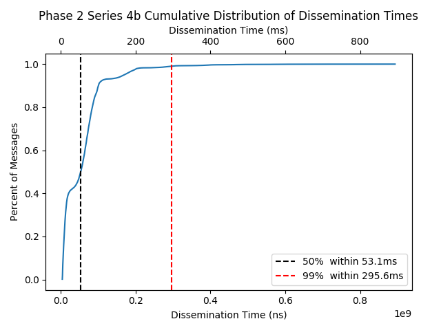
</p>

<p align="left"> 
    Graph 20: Phase 2 Series 4a
    &nbsp;&nbsp;&nbsp;&nbsp;&nbsp;&nbsp;&nbsp;&nbsp;&nbsp;&nbsp;&nbsp;&nbsp;
    &nbsp;&nbsp;&nbsp;&nbsp;&nbsp;&nbsp;&nbsp;&nbsp;&nbsp;&nbsp;&nbsp;&nbsp;
    &nbsp;&nbsp;&nbsp;&nbsp;&nbsp;&nbsp;&nbsp;&nbsp;&nbsp;&nbsp;&nbsp;&nbsp;
    &nbsp;&nbsp;&nbsp;&nbsp;&nbsp;&nbsp;&nbsp;&nbsp;&nbsp;&nbsp;&nbsp;&nbsp;
    Graph 21: Phase 2 Series 4b
</p>

<p float="center">
    
</p>

<p align="left"> 
    Graph 22: Phase 2 Series 4c
</p>

##### Phase 2 Series 5 - 400ms Increased Latency Test

This test series introduced higher network latencies. Similarly to Series 2, which introduced a network latency of 100ms, the shape of the distribution followed a spike followed by an exponential decay. However, the initial spike for tests 5b, 5c, and 5d are located at 800ms. Like Series 2, most messages exhibted a last delivery hop measure of 4. With a network latency of 400ms, the expected message dissemination time should be 1600ms, however most messages were disseminated in 800ms. 

<p align="center">
    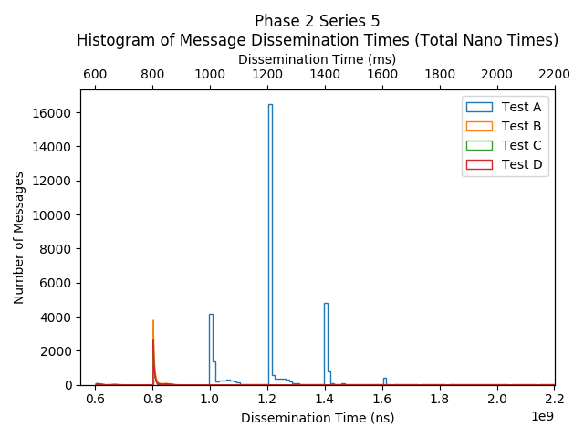
</p>

<p align="center"> Graph 23: Phase 2 Series 5 a-d Total Nano Time  </p>

<p float="center">
    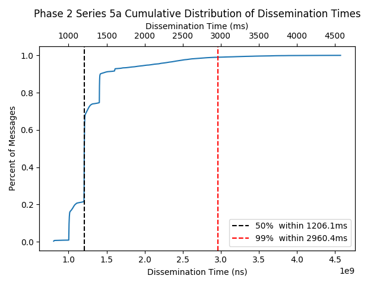
    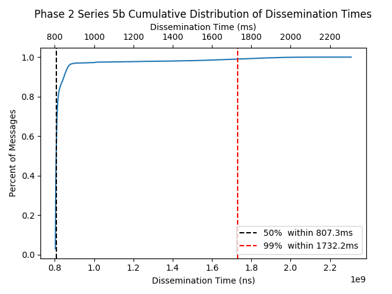
</p>

<p align="left"> 
    Graph 24: Phase 2 Series 5a
    &nbsp;&nbsp;&nbsp;&nbsp;&nbsp;&nbsp;&nbsp;&nbsp;&nbsp;&nbsp;&nbsp;&nbsp;
    &nbsp;&nbsp;&nbsp;&nbsp;&nbsp;&nbsp;&nbsp;&nbsp;&nbsp;&nbsp;&nbsp;&nbsp;
    &nbsp;&nbsp;&nbsp;&nbsp;&nbsp;&nbsp;&nbsp;&nbsp;&nbsp;&nbsp;&nbsp;&nbsp;
    &nbsp;&nbsp;&nbsp;&nbsp;&nbsp;&nbsp;&nbsp;&nbsp;&nbsp;&nbsp;&nbsp;&nbsp;
    Graph 25: Phase 2 Series 5b
</p>

<p float="center">
    
    
</p>

<p align="left"> 
    Graph 26: Phase 2 Series 5c
    &nbsp;&nbsp;&nbsp;&nbsp;&nbsp;&nbsp;&nbsp;&nbsp;&nbsp;&nbsp;&nbsp;&nbsp;
    &nbsp;&nbsp;&nbsp;&nbsp;&nbsp;&nbsp;&nbsp;&nbsp;&nbsp;&nbsp;&nbsp;&nbsp;
    &nbsp;&nbsp;&nbsp;&nbsp;&nbsp;&nbsp;&nbsp;&nbsp;&nbsp;&nbsp;&nbsp;&nbsp;
    &nbsp;&nbsp;&nbsp;&nbsp;&nbsp;&nbsp;&nbsp;&nbsp;&nbsp;&nbsp;&nbsp;&nbsp;
    Graph 27: Phase 2 Series 5d
</p>

##### Phase 2 Series 6 - Stress Test

This test series introduced all typical network impairments to emulate a typical network scenario. Because of the 150ms network latencies, the distribution of last delivery hops was more constant (i.e., last delivery hop of 4 for most messages). However, with the packet loss as well as lower bandwidth used, lobes in the histogram of message dissemination times appeared again. This suggests that the other impairments should vary the distribution of last delivery hops. However, the results show that most messages experienced a LDH of 4 with a small subset experiencing a LDH of 3. The messages with LDH of 3 may be the cause of the lobes. Nonetheless, the overall performance behaves favorably for the Ethereum 2.0 spec.

<p align="center">
    
</p>

<p align="center"> Graph 28: Phase 2 Series 6 a-d Total Nano Time </p>

<p float="center">
    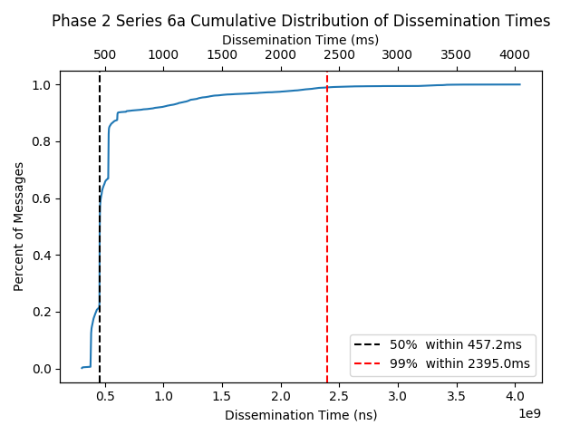
    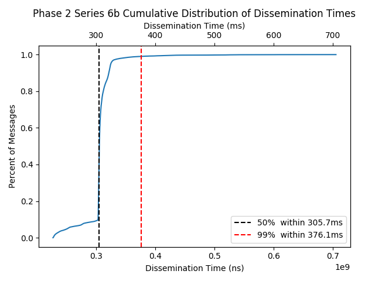
</p>

<p align="left"> 
    Graph 29: Phase 2 Series 6a
    &nbsp;&nbsp;&nbsp;&nbsp;&nbsp;&nbsp;&nbsp;&nbsp;&nbsp;&nbsp;&nbsp;&nbsp;
    &nbsp;&nbsp;&nbsp;&nbsp;&nbsp;&nbsp;&nbsp;&nbsp;&nbsp;&nbsp;&nbsp;&nbsp;
    &nbsp;&nbsp;&nbsp;&nbsp;&nbsp;&nbsp;&nbsp;&nbsp;&nbsp;&nbsp;&nbsp;&nbsp;
    &nbsp;&nbsp;&nbsp;&nbsp;&nbsp;&nbsp;&nbsp;&nbsp;&nbsp;&nbsp;&nbsp;&nbsp;
    Graph 30: Phase 2 Series 6b
</p>

<p float="center">
    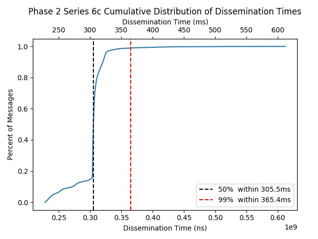
    
</p>

<p align="left"> 
    Graph 31: Phase 2 Series 6c
    &nbsp;&nbsp;&nbsp;&nbsp;&nbsp;&nbsp;&nbsp;&nbsp;&nbsp;&nbsp;&nbsp;&nbsp;
    &nbsp;&nbsp;&nbsp;&nbsp;&nbsp;&nbsp;&nbsp;&nbsp;&nbsp;&nbsp;&nbsp;&nbsp;
    &nbsp;&nbsp;&nbsp;&nbsp;&nbsp;&nbsp;&nbsp;&nbsp;&nbsp;&nbsp;&nbsp;&nbsp;
    &nbsp;&nbsp;&nbsp;&nbsp;&nbsp;&nbsp;&nbsp;&nbsp;&nbsp;&nbsp;&nbsp;&nbsp;
    Graph 32: Phase 2 Series 6d
</p>


### Phase 2 Resource Utilization Results


In prior work, resource utilization was a large concern for the bottlenecking of the gossipsub protocol. In our tests, each node was allocated 1 CPU, and the aggregated resource usage was logged during the full duration of the warm-up, test, and cool-down. The results show that there was sufficient CPU resources for the tests performed. The maximum cpu usage in a single test run ranged between  19% - 72% usage. The average cpu usage per test run ranged from ~0.04% - 1%. The variance is due to the distribution of peers (network degree) that was generated by the random Barabasi-Albert Connected Graph Algorithm. Nonetheless, the CPU utilization never approached 100% which verifies that CPU load was not a bottleneck during tests.


The behavior observed in Phase 2 series 5 and 6 are interesting as those test series had the harshest network impairments applied. Series 5 was introduced to a delay of 400ms, and series 6 had a delay of 150ms, bandwidth of 10mb, and packet loss of 0.01%. The results suggest that network impairments may reduce the overall CPU load of a test. Possible reasons for this could be the network delays reduce the load on the go-libp2p stack. Traffic shaping is performed via `tc`, which is known to also consume CPU resources. `tc` essentially creates virtual queues and gates packet transmissions which means data is indeed queued. However, these queues are operating at a lower layer in the network stack. It is possible go-libp2p resource consumption increases when messages arrive and are queued at the application layer. Nonetheless, the CPU utilization never approached 100% which verifies that the cloud instance had sufficient resources to not present a processing bottleneck.

* [Resource Usage Sheet](https://docs.google.com/spreadsheets/d/1ZoY8Rz-BqKiX-ik9Wdd-zfR0mcoOj_CYUSz8tSwtb6w/edit#gid=228791707)

### Potential go-libp2p-pubsub Inefficiencies

During our testing initiatives, there were a few observations that we suggest be investigated further by the go-libp2p-pubsub community.

After [MDR Fix #2](#MDR-Fix-1-for-Phase-2---Outbound-Peer-Queue-Size), the Orchestra’s message interarrival times experienced erratic and high variations. Overall, this behavior may have a slight impact on the message time since measurements are only made from initial transmission to complete dissemination.

- In order to verify the interarrival times, a local test on a PC with 4 cores and 16GB of RAM with 10 nodes and a topology generated with an input degree parameter of 2. Graphs 10 and 11 below illustrate these interarrival times and compare the actual message transmission time with the expected transmission time during a test. These graphs show that nodes are blocking at some point in the code. Further investigation on this behavior is suggested to diagnose this implementation weakness.

- After initial investigation, the reason for this behavior could not be identified. Potential culprits for this may be unexpected behviors caused by gRPC, gossipsub, testing environment, etc. Further testing will need to be conducted in order to get more conclusive evidence for where this issue may be originating from.

- A potential way to verify the cause of these volatile interarrival message times is to integrate the [Libp2p Tracer library](https://github.com/libp2p/go-libp2p-pubsub#tracing) that provides additional tooling for analyzing the Gossipsub protocol in operation. This testing effort did not allow enough time for the integration of the Tracer tooling and we were unable to identify why there were varying interarrival times.

<p align="center">
    
</p>

<p align="center"> Graph 10: Example Message Interarrival Times </p>

<p align="center">
    
</p>

<p align="center"> Graph 11: Example Message Transmission Timeline </p>


The initial test results found in the preliminary tests had an incredibly high amount of message loss (~30%). The bug had been found and fixed ([see PR](https://github.com/araskachoi/go-libp2p-pubsub-benchmark-tools/pull/1)) and the result of subsequent tests yielded all (or nearly all) messages reaching their destinations. 

The results of test Series 3 Case A include message losses. Logs show that the network load generating node (Orchestra) successfully sent a RPC request for a node to transmit a message. This can be seen in the Orchestra log screenshot in Figure 1. This indicates that messages were lost at nodes, perhaps due to go channel overflows. The go channels could not be viewed as no channel logger was implements. While the logs showed that the messages were still in transit, we removed them from analysis and treated them as message losses. The total number of messages lost was 236. 

<p align="center">
    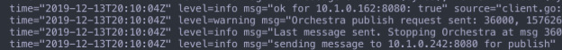
</p>
<p align="center"> Figure 1: Series3a Messages</p>

### Configuration
For each set of tests, the corresponding configuration used in running the [`agencyenterprise/go-libp2p-pubsub-benchmark-tools`](https://github.com/agencyenterprise/go-libp2p-pubsub-benchmark-tools) and the [`whiteblock/go-libp2p-pubsub-benchmark-tools`](https://github.com/whiteblock/go-libp2p-pubsub-benchmark-tools) implementations will be posted.

Example host.json:
```
{
  "host": {
    "privPEM": "",
    "transports": ["tcp", "ws"],
    "listens": ["/ip4/0.0.0.0/tcp/3000","/ip4/0.0.0.0/tcp/3001/ws"],
    "rpcAddress": "0.0.0.0:8080",
    "peers": [],
    "muxers": [["yamux", "/yamux/1.0.0"], ["mplex", "/mplex/6.7.0"]],
    "security": "secio",
    "pubsubAlgorithm": "gossip",
    "omitRelay": false,
    "omitConnectionManager": false,
    "omitNATPortMap": false,
    "omitRPCServer": false,
    "omitDiscoveryService": true,
    "omitRouting": true,
    "loggerLocation": ""
  }
}

```

Example orchestra.json:
```
{
  "orchestra": {
    "omitSubnet": true,
    "hostRPCAddressesIfOmitSubnet": [<list-of-IPs>],
    "messageNanoSecondInterval": 100000000,
    "clientTimeoutSeconds": 5,
    "messageLocation": "client.message.json",
    "messageByteSize": 1000,
    "testDurationSeconds": 90,
    "testWarmupSeconds": 10,
    "testCooldownSeconds": 10
  },
  "subnet": {
    "numHosts": 10,
    "pubsubCIDR": "127.0.0.1/8",
    "pubsubPortRange": [3000, 4000],
    "rpcCIDR": "127.0.0.1/8",
    "rpcPortRange": [8080, 9080],
    "peerTopology": "whiteblocks"
  },
  "host": {
    "transports": ["tcp", "ws"],
    "muxers": [["yamux", "/yamux/1.0.0"], ["mplex", "/mplex/6.7.0"]],
    "security": "secio",
    "pubsubAlgorithm": "gossip",
    "omitRelay": false,
    "omitConnectionManager": false,
    "omitNATPortMap": false,
    "omitRPCServer": false,
    "omitDiscoveryService": false,
    "omitRouting": false
  },
  "general": {
    "loggerLocation": ""
  }
}

```

/etc/docker/daemon.json
```
{
        "max-concurrent-uploads":1,
        "storage-driver": "overlay",
        "log-driver":"gcplogs"
}
```

## Next Steps - Community Solicited Research

While the first two phases of this testing effort shows that the Libp2p Gossipsub protocol performs sufficiently well for Ethereum 2.0 specifications, testing with a larger network size should be the primary focus for future work. Before testing larger network sizes, various improvements to the go-libp2p-pubsub implementation as well as the testing methodology should be completed. Below is a non-exhaustive list of todos for the community:

* Permanent fix which does not require manually increasing Golang channel queue sizes in go-libp2p-pubsub should be implemented.
* `go-libp2p-pubsub-tracer` should be integrated into the node implementation for tests
* Erratic message interarrival times should be investigated and fixed
* Testing methodology should port to the next version of Whiteblock Genesis for larger scale tests 
* Integrate floodsub into testing methodology for comparison.

With these additional features, a richer set of future tests can be performed. Lastly, future work should include the variation of gossipsub parameters (e.g. GossipSubD, GossipSubHeartbeatInterval, etc.) at different network sizes.

## References

[1] R. Bakhshi, F. Bonnet, W. Fokkink, and B. Haverkort, “Formal analysis techniques for gossiping protocols,”SIGOPS Oper. Syst.Rev., vol. 41, no. 5, pp. 28–36, Oct. 2007.

[2] J. Leitão, J. Pereira, and L. Rodrigues, “Epidemic broadcast trees,” Proc. IEEE Symp. Reliab. Distrib. Syst., pp. 301–310, 2007.

[3] R.  Albert  and  A.-L.  Barabasi,  “Statistical  mechanics  of  complex  networks,”Reviews of Modern Physics, vol. 74, no. 1, p. 47–97, Jan 2002.

[4] A. Montresor, “Gossip and epidemic protocol,” Wiley Encyclopedia of Electrical and Electronics Engineering, vol. 1, 2017.

[5] eth2 phase 0 networking requirements, "https://notes.ethereum.org/zgzMxFNiSF-iW5wA5uKH0Q?view"

[6] https://github.com/libp2p/go-libp2p-pubsub/blob/01b9825fbee1848751d90a8469e3f5f43bac8466/gossipsub.go#L32
